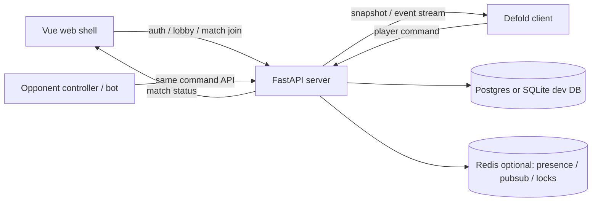

# Server Authority Design

CylinderDicer의 제품 매치는 서버 권위형으로 간다.

Defold와 Vue는 클라이언트다. 둘 다 유저 기기에서 실행되므로 신뢰하지 않는다. 클라이언트는 화면 렌더링, 입력 수집, 애니메이션, 사운드, 네트워크 송수신만 담당한다. 매치 규칙, 난수, 판정, HP/총알/주사위 상태, 승패, 보상 반영은 Python/FastAPI 서버가 최종 권위를 가진다.

## 목표

- 게임 규칙을 Defold GUI나 web client에 흩뿌리지 않는다.
- 같은 매치를 재생 가능한 event log로 남긴다.
- 클라이언트 조작, devtool 변조, replay 공격을 서버에서 거른다.
- Defold 프로토콜을 지킨다. GUI script는 게임 로직을 직접 바꾸지 않고 message/adapter 경계로 입력을 보낸다.
- QA opponent controller/bot도 제품 클라이언트와 같은 command 계약을 사용한다.

## 현재 상태와 전환 방향

현재 구현은 Defold 안의 `game/model/*` reducer/store/rules가 임시 권위자 역할을 한다. 이 구조는 로컬 세로 슬라이스와 QA에는 좋았지만, 제품 구조로는 부족하다.

| 영역 | 현재 | 목표 |
| --- | --- | --- |
| 매치 권위 | Defold local store | FastAPI match server |
| GUI 입력 | GUI script가 store/action 직접 require | GUI → controller message → network adapter |
| 상태 변경 | client reducer가 즉시 판정 | server command 검증 후 snapshot/event 수신 |
| opponent QA | `vertual-server/`가 Defold 파일 bridge | FastAPI dev server 또는 같은 command API |
| 결과 제출 | Defold가 결과 payload 생성 | server가 match complete와 rewards 확정 |

`vertual-server/`는 이름 그대로 로컬 QA bridge다. 제품 서버가 아니다. 새 제품 서버는 root의 `server/` 디렉터리에 Python/FastAPI로 둔다.

## 책임 분리

### FastAPI server

서버가 소유한다.

- match 생성, 참가자, seat/order, local/remote role
- turn/phase FSM
- dice roll RNG
- cylinder spin/trigger/load legality
- bid validation
- duel judge/resolution
- HP, elimination, winner
- command idempotency, rate limit, timeout 처리
- event log와 snapshot revision
- ranked/casual 결과 확정
- 보상, 랭킹, 재화 변경의 서버 측 요청

### Defold client

Defold는 소유하지 않는다.

- 최종 HP/총알/주사위/승패
- 결투 판정
- 난수 결과
- 다음 turn 결정
- 보상 지급

Defold가 담당한다.

- server snapshot 렌더링
- 입력 수집
- 입력을 command로 변환해 server adapter에 전송
- server events를 받아 애니메이션으로 재생
- 예측 렌더링이 필요하면 표시 전용 optimistic state만 사용
- offline/dev 모드에서는 server simulator adapter를 붙일 수 있지만, 제품 모드와 경계를 명확히 둔다

### Vue web client

Vue가 담당한다.

- 로그인, 로비, 매치메이킹 UI
- Defold canvas embed
- HTTP/WebSocket connection bootstrap
- auth token/session 전달
- match 입장/퇴장/재접속 UX
- 계정, 상점, 인벤토리, 랭킹 화면

Vue도 게임 판정은 하지 않는다.

## High-level architecture



초기 개발은 SQLite + in-memory connection registry로 시작해도 된다. 단, API와 domain layer는 Postgres/Redis로 옮길 수 있게 분리한다.

## Server runtime choice

- Language: Python
- Web framework: FastAPI
- Validation: Pydantic models
- Transport:
  - HTTP for match creation, snapshot fetch, command submit
  - WebSocket for live snapshot/event push
- Test runner: pytest
- Dev DB: SQLite
- Production DB candidate: Postgres

## Suggested directory

```text
server/
  pyproject.toml
  README.md
  src/cylinderdicer_server/
    main.py
    app.py
    config.py
    api/
      routes_health.py
      routes_matches.py
      routes_commands.py
      websocket.py
    domain/
      state.py
      actions.py
      reducer.py
      rules_bidding.py
      rules_cylinder.py
      rules_dice.py
      rules_duel.py
      turn_machine.py
    persistence/
      event_store.py
      snapshots.py
    protocol/
      commands.py
      snapshots.py
      errors.py
    tests/
      test_model_flow.py
      test_command_validation.py
      test_reconnect.py
```

`domain/`은 Defold의 현재 `play/game/model/*`에서 옮겨올 순수 규칙 계층이다. Defold API, FastAPI request 객체, DB 객체를 직접 import하지 않는다.

## Protocol principles

### Command

클라이언트는 “내가 하고 싶은 행동”만 보낸다. 결과를 보내지 않는다.

```json
{
  "command_id": "client-generated-uuid",
  "match_id": "match_123",
  "actor_id": "player_abc",
  "revision": 42,
  "type": "bid.raise",
  "payload": {
    "count": 8,
    "face": 3
  }
}
```

규칙:

- `command_id`는 idempotency key다. 같은 command가 재전송되면 같은 결과를 반환한다.
- `revision`은 클라이언트가 본 마지막 snapshot revision이다. 서버는 너무 오래된 revision이면 `stale_revision`을 반환하거나 최신 snapshot을 함께 보낸다.
- `actor_id`는 auth/session과 일치해야 한다. 클라이언트가 임의로 opponent actor를 보낼 수 없다.
- command payload는 intent만 담는다. dice 값, judge 결과, damage 결과, winner는 payload에 넣지 않는다.

### Event

서버는 검증된 상태 변화만 event log에 기록한다.

```json
{
  "event_id": 118,
  "match_id": "match_123",
  "type": "bid.accepted",
  "actor_id": "player_abc",
  "payload": {
    "count": 8,
    "face": 3
  },
  "revision": 43,
  "created_at": "2026-06-28T12:34:56Z"
}
```

이벤트는 replay와 감사의 기준이다. snapshot은 이벤트에서 파생 가능해야 한다.

### Snapshot

Defold 렌더링은 snapshot을 기준으로 한다.

```json
{
  "protocol_version": 1,
  "match": {
    "id": "match_123",
    "status": "ready",
    "mode": "casual",
    "turn_count": 7
  },
  "revision": 43,
  "phase": "bidding",
  "hud": "bidding",
  "turn": {
    "active_player_id": "player_abc",
    "previous_player_id": "player_prev",
    "round_index": 1
  },
  "players": [],
  "available_actions": []
}
```

Snapshot은 private/public view를 구분한다.

- 자기 dice는 본인에게만 보낸다.
- opponent dice는 reveal 전까지 숨긴다.
- QA/dev observer는 별도 권한으로 full snapshot을 받을 수 있다.

## HTTP API draft

### Health

```http
GET /healthz
```

응답:

```json
{ "ok": true }
```

### Create dev match

```http
POST /v1/matches
```

요청:

```json
{
  "mode": "dev",
  "players": [
    { "id": "local-player", "name": "You" },
    { "id": "opponent-1", "name": "Hush Feather" }
  ]
}
```

응답:

```json
{
  "match_id": "match_123",
  "revision": 1,
  "snapshot": {}
}
```

### Fetch snapshot

```http
GET /v1/matches/{match_id}/snapshot
```

응답은 요청자 권한에 맞는 snapshot이다.

### Submit command

```http
POST /v1/matches/{match_id}/commands
```

응답:

```json
{
  "ok": true,
  "command_id": "cmd_123",
  "revision": 44,
  "events": [],
  "snapshot": {}
}
```

실패:

```json
{
  "ok": false,
  "error": {
    "code": "not_actor_turn",
    "message": "It is not this actor's turn."
  },
  "snapshot": {}
}
```

### WebSocket

```text
WS /v1/matches/{match_id}/stream?token=...
```

서버 → 클라이언트:

```json
{ "type": "snapshot", "payload": {} }
{ "type": "events", "payload": [] }
{ "type": "error", "payload": { "code": "stale_revision" } }
```

클라이언트 → 서버:

```json
{ "type": "command", "payload": {} }
{ "type": "ping" }
```

## Command types

초기 제품/QA 공통 command:

- `setup.load_initial`
- `shake.roll`
- `dice.check`
- `bidding.open`
- `bullet.load`
- `bid.select_count`
- `bid.select_face`
- `bid.raise`
- `bid.challenge`
- `duel.execute`
- `round.advance`

주의: `duel.execute`, `round.advance`, `bidding.open`은 제품에서는 일반 클라이언트가 직접 누르는 command가 아닐 수 있다. 서버 timer 또는 internal system actor가 실행한다. dev/QA에서는 명시 command로 열어 둘 수 있다.

## Server-side validation

서버는 모든 command에서 최소한 아래를 검사한다.

- match exists
- match not complete
- actor is participant or authorized QA actor
- actor has permission for command
- phase/turn matches command
- pending load target matches actor
- bid is strictly higher than current bid
- challenge has previous bid
- slot index is valid and empty
- command is not duplicate with conflicting payload

클라이언트의 `available_actions`는 UX 힌트일 뿐이다. 서버 validation이 최종 권위다.

## RNG and fairness

서버만 RNG를 실행한다.

- dice roll
- revolver spin
- bot/random timeout fallback

권장:

- match마다 `server_seed`를 생성한다.
- event log에 seed 자체를 바로 노출하지 않는다.
- 필요하면 `seed_commit = sha256(server_seed)`를 match 시작 시 기록하고, match 종료 후 공개해 replay 검증을 가능하게 한다.

## Defold integration target

Defold 쪽 장기 목표:

```text
GUI script
  -> msg.post("/game#client_controller", "player_command", payload)
  -> client_controller.script
  -> server_adapter.lua
  -> HTTP/WebSocket
  -> server snapshot/event
  -> local render cache
  -> GUI render
```

금지할 것:

- GUI script가 `game.model.actions`를 직접 require
- GUI script가 `game.model.store`를 직접 require
- GUI script가 game rule module을 직접 호출
- client가 dice/duel/winner를 자체 확정

허용할 것:

- GUI script가 selector/view-model을 읽어 자기 노드 렌더링
- GUI script가 message로 input intent 전달
- dev adapter가 local simulator로 command를 처리
- tests가 domain reducer를 직접 호출

## Migration plan

### Phase 1: Contract first

- `SERVER.md`를 기준 문서로 둔다.
- `shared/protocol/`에 match command/snapshot 타입을 추가한다.
- 현재 `shared/qa/protocol.ts`는 dev observer protocol로 유지하되, 제품 command와 이름을 맞춘다.

### Phase 2: Python domain port

- `play/game/model/rules/*`와 `turn_machine.lua`의 순수 규칙을 Python으로 포팅한다.
- Lua model tests와 같은 시나리오를 pytest로 옮긴다.
- 현재 16개 model flow test를 server test baseline으로 삼는다.

### Phase 3: FastAPI dev server

- `server/` 생성.
- HTTP command + snapshot API 구현.
- SQLite event log persistence 구현.
- local dev match 생성 endpoint 구현.

### Phase 4: Defold server adapter

- Defold `store.dispatch()` 직접 입력 경로를 controller message로 교체한다.
- server snapshot을 받아 render cache를 갱신한다.
- GUI는 render cache만 본다.
- latency가 보이면 optimistic UI는 별도 표시 전용 layer로 추가한다.

### Phase 5: QA tools migration

- `opponent-controller/`와 `opponent-bot/`을 FastAPI command API로 연결한다.
- `vertual-server/`는 legacy QA bridge로 남기거나 제거한다.
- `/tmp/cylinderdicer_qa_status.txt` 파일 bridge는 dev-only fallback으로 격하한다.

### Phase 6: Production hardening

- auth/session binding
- reconnect/resync
- command timeout
- event log compaction
- deployment config
- metrics/logging
- anti-cheat audits

## Handling the Defold protocol findings

### GUI direct game logic

서버 권위형 전환 후 GUI는 store/action을 직접 import하지 않는다. 중간 단계에서는 `client_controller.script`를 추가해 아래처럼 한 번 감싼다.

```text
bid_controls.gui_script
  -> msg.post("/game#client_controller", "bid_raise", { count, face })
  -> client_controller.script
  -> server_adapter.submit_command(...)
```

### CJK font

서버 설계와 별개로 반드시 처리한다.

- `assets/fonts/`에 CJK 지원 font resource 추가
- 모든 Korean/Japanese text GUI에서 해당 font 사용
- default font에 CJK glyph가 있다고 가정하지 않는다

### Input focus

서버 전환과 함께 input도 controller 하나로 모은다.

- active HUD만 focus 획득
- 가능하면 `/game#input_router` 하나가 raw input을 받고 active screen에 message로 전달
- 비활성 GUI는 input focus를 보유하지 않는다

### Input action filter

`on_input`는 `action_id`를 반드시 검사한다.

예:

```lua
if action_id ~= hash("touch") and action_id ~= hash("mouse_button_left") then
    return false
end
```

`cylinder_overlay.script`는 pointer/touch 계열만 처리해야 한다.

## Open questions

- 첫 제품 transport는 HTTP polling + command response로 충분한가, WebSocket을 바로 넣을 것인가?
- ranked match에서 server seed 공개 검증을 어느 수준까지 제공할 것인가?
- mobile native build도 같은 FastAPI endpoint를 사용할 것인가?
- BACKND는 계정/결제/랭킹용으로만 쓰고 match server는 별도 운영할 것인가?
- bot/opponent AI를 server-side actor로 둘 것인가, 외부 client로 둘 것인가?

## Non-goals

- Defold를 제거하지 않는다.
- Vue가 게임 판정을 맡지 않는다.
- FastAPI가 렌더링이나 애니메이션 timing을 소유하지 않는다.
- QA bridge인 `vertual-server/`를 제품 서버로 승격하지 않는다.
