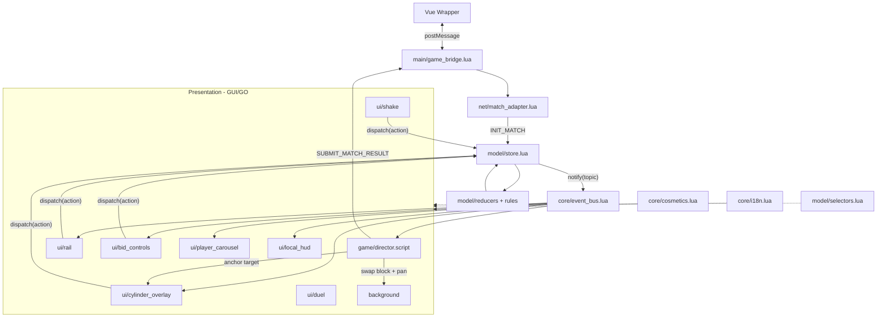

## 1. 핵심 설계 원칙
- `play/DISPLAY.md`의 의사코드는 `emit(action)`으로 디스패치하고 `state`/`data`를 읽는 **반응형 단방향 흐름**을 전제한다. 따라서 아키텍처 중심을 **Flux/Redux-lite 단방향 데이터 흐름**으로 잡는다.
- `README.md`의 게임 규칙(베팅/장전/결투 판정/PerfectDuel)은 **Defold가 로컬에서 계산**하고, 서버는 사후 검증한다(`SUBMIT_MATCH_RESULT`).
- 도메인 규칙(순수 Lua)과 화면(Defold GUI/GO)을 **엄격히 분리**해 테스트·재사용·치장(스킨) 교체를 쉽게 한다.
- 문자열은 하드코딩 금지, `i18n.t(key, params)`로만 인용(기존 `assets/locale/*.json` 활용).

## 2. 채택 디자인 패턴
- 계층형 MVC: Model(순수 Lua) / View(GUI·GO) / Controller(director).
- 단방향 데이터 흐름(Flux): `View -> dispatch(action) -> reducer -> store -> notify -> View`.
- Observer(pub/sub): `core/event_bus.lua` 토픽 구독으로 store 변경을 View에 전파.
- 유한 상태 기계(FSM): 턴 종류(`setup -> shaking -> bidding* -> dualing -> shaking`)와 결투 시퀀스(`revealDice -> panToTable -> judge -> execute`).
- Command/Action: 모든 입력을 액션 객체로 표준화(`bid.raise`, `bid.challenge`, `bullet.load`, `shake.roll` 등).
- Singleton Overlay + Anchor: `cylinderOverlay`는 단일 영구 인스턴스, `anchors`가 좌표만 제공, tween으로 이동.
- Adapter: 브릿지/백엔드 연동을 어댑터로 캡슐화(`game_bridge.lua`, `match_adapter.lua`).

## 3. 계층 / 데이터 흐름

## 4. 제안 디렉토리 구조 (play/ 추가분)
기존 `main/`, `input/`, `assets/`, `debugger/`는 유지하고 아래를 추가한다.

- `game/director.script` — 오케스트레이터(아래 5장).
- `game/model/` — 순수 Lua 도메인 (Defold API 미사용):
  - `store.lua`, `reducers.lua`, `actions.lua`, `selectors.lua`, `turn_machine.lua`
  - `rules/bidding.lua`, `rules/cylinder.lua`, `rules/dice.lua`, `rules/duel.lua`
- `game/core/` — 엔진 인지 인프라:
  - `event_bus.lua`, `i18n.lua`, `cosmetics.lua`, `anchors.lua`, `audio.lua`, `tween.lua`, `gestures.lua`
- `game/net/match_adapter.lua` — 브릿지 payload ↔ store 변환.
- `ui/` — Defold GUI 씬 + gui_script(뷰 컴포넌트):
  - `turn_indicator/`, `player_carousel/`, `bid_controls/`, `rail/`, `local_hud/`, `cylinder_overlay/`, `duel/`, `shake/`, `common/`(DiceFace·Badge·Button·ArrowButton 템플릿)
- `background/` — 세로 파노라마 GO + 패닝 스크립트.

렌더링 방식: **하이브리드 권장** — 레이아웃/텍스트/버튼/배지는 GUI, 대형 일러스트·배경 파노라마·컵·실린더·주사위 굴림 연출은 GO+sprite(카메라). 두 표현 모두 동일한 store/event_bus를 구독한다. 컵은 `shake.gui` node가 아니라 배경/테이블 시점에 묶인 world prop이다.

## 5. 모듈별 책임과 상호작용 (문서의 핵심 표)
- `main/main.script`(리팩터): 부트스트랩/composition root. 브릿지 install, store 생성, director 마운트, 입력 포커스 초기화. ↔ `game_bridge`, `store`, `director`.
- `game/director.script`: 턴 FSM 구동, 활성 블럭 교체(`BlockController`), `bgAnimate` 동기화, `cylinderTarget()` 앵커 결정, 결투 종료 시 결과 emit. setup/bidding은 파노라마 상단, shaking/dualing은 테이블 하단으로 배경을 이동시킨다. ↔ `turn_machine`, `event_bus`, `anchors`, `tween`, 모든 `ui/*`, `background`, `bridge`.
- `model/store.lua`: 단일 상태 + `dispatch(action)` + `subscribe()`. ↔ `reducers`, `event_bus`.
- `model/reducers.lua`: 액션→다음 상태(순수). ↔ `rules/*`, `actions`.
- `model/actions.lua`: 액션 타입 상수/생성자. ↔ 모든 View, `reducers`.
- `model/selectors.lua`: 파생 읽기(`visibleRange`, `myBid.isValid`, `countFace`, `hintKey`). ↔ View, `rules`.
- `model/turn_machine.lua`: 턴 전이 규칙(FSM). ↔ `reducers`, `director`.
- `rules/bidding.lua`: 콜 유효성/상승 규칙. `rules/cylinder.lua`: 슬롯 장전/`pendingLoad`/장전 타이밍. `rules/dice.lua`: 흔들기 랜덤 배정, 면 의미(1=해골). `rules/duel.lua`: 판정(SHORT/OVER/EXACT) + `DuelResolution`/`PerfectDuel`(README 정책). ↔ `reducers`, `selectors`.
- `core/event_bus.lua`: 토픽 pub/sub. ↔ `store`, 모든 View, `director`.
- `core/i18n.lua`: `t(key, params)`, 로케일 로드. ↔ View, `cosmetics`.
- `core/cosmetics.lua`: skinId→atlas/이미지 해석(dice/cup/revolver/bg/rail), Live Update 대비. 컵 스킨은 배경/테이블 world prop에 적용한다. ↔ View, `match_adapter`.
- `core/anchors.lua`: 명명 앵커→화면 좌표(`hud/focal/offscreen`). ↔ `director`, `cylinder_overlay`, `local_hud`.
- `core/audio.lua`: sfx/bgm/voice 재생. ↔ `director`, `duel`, `shake`.
- `core/tween.lua`: easing 헬퍼(`bgAnimate`, AnchorMover). ↔ `director`, `background`, `cylinder_overlay`.
- `core/gestures.lua`: 드래그/스크롤/←→/터치 제스처 정규화. ↔ `rail`, `shake`, `common`.
- `net/match_adapter.lua`: `START_MATCH`→`INIT_MATCH` 액션, 결과→`SUBMIT_MATCH_RESULT`. ↔ `bridge`, `store`, `cosmetics`.
- `ui/*` gui_script: 구독한 토픽으로 자기 노드만 갱신, 입력을 액션으로 디스패치. ↔ `store`, `event_bus`, `selectors`, `i18n`, `cosmetics`, `gestures`.

## 6. 대표 데이터 흐름 (문서에 시퀀스로 수록)
- 베팅 상승: rail 드래그(또는 화살표 클릭, 키보드 arrow 입력 등) → `dispatch(bid.raise)` → `rules/bidding` 검증 → store 갱신 → `bid`/`rail` 토픽 → BidControls·rail·carousel 갱신.
- 흔들기+장전: shake 입력 → `dispatch(shake.roll)` → `rules/dice` 배정 + `pendingLoad` 설정 → director가 cylinder 앵커를 `focal`로 → 슬롯 탭 `dispatch(bullet.load,i)` → 완료 시 `hud` 앵커 복귀.
- 결투: `dispatch(bid.challenge)` → turn_machine `dualing` → director가 결투 시퀀스 실행(reveal→pan→judge→execute) → `rules/duel` 결과 + 연출/사운드 → 종료 후 `shaking` 복귀, 매치 종료 시 결과 emit.

## 7. ARCHITECTURE.md 문서 구성(섹션)
개요/원칙 → 디자인 패턴 → 계층·데이터 흐름(mermaid) → 디렉토리 구조 → 렌더링 전략(GUI/GO) → 모듈 책임·상호작용 표 → 턴/결투 FSM(mermaid) → 대표 데이터 흐름 → 브릿지·i18n·치장 연동 → 확장/미정(멀티플레이 권위, 전투 씬 와이어프레임 이후).
