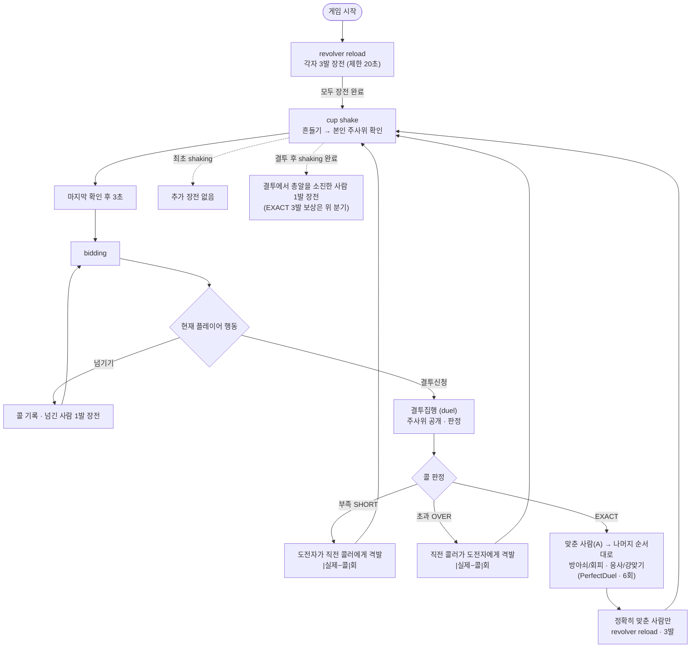

## 게임 진행 흐름

게임 시작:
    `revolver reload` 부터 시작. 3개의 탄을 원하는 실린더에 장전한다.
    제한시간 20초, 넘어가면 임의로 실린더 위치에 총알 채워넣음.

모두가 장전 완료 시:
    `cup shake` HUD/배경으로 이동. [space] 키 6번 정도 입력으로 흔들고 나면(또는 제한시간 20초 지나면) 플레이어 본인 주사위 확인.
    (다른 사람 컵들도 흔드는 것은 realtime으로 보여줌. 주사위 공개는 안하지만.)
    (최초 쉐이킹은 추가 장전 없음. 결투 후 쉐이킹은 결투에서 총알을 소진한 사람이 있을 때만 완료 후 1발 장전.
     EXACT 결투 직후에는 정확히 맞춘 사람만 3발 충전 후 shaking 시작하며, 이후 active player 추가 장전은 없음 — 아래 `## duel` 참고.)

가장 최후에 주사위 눈 확인한 사람이 확인한 후 3초 지나면:
    `bidding` HUD/배경으로 넘어감.
        내 턴이 아니면:
            Carousel 상으로 중앙에 표시된 현재 플레이어의 플레이를 기다리게 됨.
            (해당 플레이어가 bidding중인 주사위 눈은 realtime으로 표시)
            bidding 마치면 다음 플레이어 턴으로 넘어가게 됨. (제한시간 30초)
            해당 플레이어가 넘기기 선택하면:
                -> 콜이 레일에 기록되고, 넘긴 본인만 우하단 cylinder에 1발 장전.
                -> 이 장전과 다음 플레이어의 bidding은 동시에 진행한다.
                -> 다음 bidding이 먼저 끝나면 장전자에게 3초가 주어지고, 나머지는 회전 실린더 loading 화면에서 기다린다.
                -> 3초 안에 직접 장전하지 않으면 첫 빈 슬롯에 자동 장전하고 다음 입찰자의 장전을 이어서 처리한다.
            해당 플레이어가 결투신청 선택하면:
                -> `결투집행`
        내 턴이면:
            넘기기 — 레일로 개수, ▲▼ 버튼(또는 키보드 화살표)로 주사위눈 선택. 직전 콜보다 높게만 가능. 확정 시 턴을 넘기고 본인은 `revolver reload` HUD에서 1발을 장전한다. 다음 active player는 이 장전과 병행해 bidding할 수 있다.
            Skull(1) 넘기기 — 입찰을 확정하기 전에 본인 실린더를 회전하고 본인 총으로 1회 격발한다. 탄환이 발사되면 본인 HP가 1 감소하고 일러스트가 진동한다. 생존하면 Skull 입찰을 확정하고, 사망하면 해당 입찰은 무효이며 기존 입찰을 유지한 채 다음 생존 플레이어로 넘어간다.
            결투신청 선택 시:
                -> `결투집행`

결투 집행 후:
    다시 `cup shake`로.
    EXACT(정확히 맞춘 턴)이면 정확히 맞춘 사람만 `revolver reload`로 3발 충전한 뒤 shaking 시작.
    그 외(부족/초과)는 바로 shaking. 실제 총알이 소진됐다면 다음 shake 완료 후 그 총알을 소진한 플레이어만 1발 장전.
    다음 라운드 첫 bidding 플레이어와 결투 후 장전 대상은 별개.
    모두 확인 후 3초 뒤 bidding 반복.

def `결투집행`상세:
    `duel` HUD/배경(테이블 시점)으로. 주사위 전원 공개
    콜 판정(부족/초과/정확) 후 `duel` HUD 띄워서 데미지 집행.
    판정 시 face `1` 해골은 특수 눈이다. 콜한 눈이 해골이 아니면 해골도 콜한 눈 집계에 포함한다. 콜한 눈이 해골이면 해골만 집계한다.
    장전 없음.
    - **부족(SHORT)**: 실제 개수가 콜보다 적음 → **도전자**가 직전 콜러에게 |실제 − 콜|번 격발. 도전자 리볼버의 장전 위치에 따라 일부만/안 나갈 수 있음.
    - **초과(OVER)**: 실제 개수가 콜보다 많음 → **직전 콜러**가 도전자에게 |실제 − 콜|번 격발. 직전 콜러 리볼버의 장전 위치에 따라 일부만/안 나갈 수 있음.
    - **정확(EXACT)**: 맞춘 당사자(A=직전 콜러)가 나머지 플레이어(B)를 순서대로 지목. A는 방아쇠/회피, B는 응사/걍맞기 선택 → README 데미지 정책표대로 처리.

# HUD 종류
- revolver reload
- cup shake
- bidding
- duel

## revolver reload

revolver의 cylinder가 중앙에 위치하고, 좌측엔 남은 장전해야 하는 총알 갯수가 표시된다. (최초 재장전 `3 ~> 0`개, EXACT 결투 후 정확히 맞춘 사람 재장전 `3 ~> 0`개, 내턴 종료 후 재장전 `1 ~> 0`개)
총알이 있는 구멍은 총알 아래(뇌관 부분)으로 메워져 있고, 넣을 수 있는 구멍은 비어있음. 비어있는 구멍에만 총알을 채울 수 있다.
장전할 때는 선택한 구멍만 채우며 실린더를 회전시키지 않는다. 결투 직전에 실제 방아쇠를 사용할 플레이어의 실린더를 무작위로 `1~6`칸 회전한다. 회전으로 넘어간 칸은 원형으로 앞으로 당겨지고, 회전 후 맨 앞 약실부터 격발 판정을 시작한다.
재장전 도중 총알이 6개가 다 차면 남은 좌측 총알 fading되며 사라짐.

Z-Stack:
    - 배경
    - `player arc` 또는 `player carousel`
    - blur shading 레이어
    - cylinder
    - bullet(세워있는/장전된 둘 다)

## cup shake

### 흔들기
컵들이 테이블 위에 놓여 있고, 각 플레이어 컵이 각자 위치에 표시된다.
하단 힌트 텍스트: "[Space]키 연타 또는 마우스로 흔들기"
흔드는 중: 내 컵이 흔들리는 애니메이션. 다른 플레이어가 흔들면 해당 컵도 realtime으로 흔들림.

Z-Stack:
    - 배경 (테이블 시점)
    - `player arc`
    - 각 플레이어 컵
    - 힌트 텍스트

### 주사위 확인
흔들기 완료 시 내 컵이 위로 올라가며 주사위가 등장.
하단 주사위 트레이에 내 주사위 눈이 일렬로 표시된다. (해골~6까지 face 아이콘)
다른 플레이어 컵은 그대로 뒤집힌 채로 유지됨 (눈 비공개).

Z-Stack:
    - 배경
    - `player arc`
    - 각 플레이어 컵 (내 컵은 반투명 또는 들린 상태)
    - 내 주사위 (컵 아래 테이블 위)
    - 하단 주사위 트레이 (내 패 요약)

### 결투 전 패 공개 (duel 진입 시)
결투신청이 들어오면 모든 플레이어 컵이 순차적으로 들리며 주사위 노출.
각 플레이어 위치 근처에 주사위 더미가 표시되고, 중앙에 눈별 집계 그리드 표시. (해골과 bidding된 주사위 눈)
하단 트레이는 내 패 그대로 유지.

Z-Stack:
    - 배경
    - `player arc`
    - 각 플레이어 주사위 더미 (컵 제거 또는 투명화)
    - 중앙 눈별 집계 그리드
    - 하단 주사위 트레이 (내 패)

## bidding

(`DISPLAY.md` 참조)

## duel

Sequence[
    "배경 shading 및 vignetting이 ease-inout 되며 나타남",
    "총을 쏘는 플레이어의 일러스트가 왼쪽, 맞는 플레이어가 오른쪽에 나타날거임. 남은 HP/총알 표시와 함께. with ease-out from left/right",
    if "bidding이 부족(SHORT)인 상황":
        for |실제−콜|번: "도전자가 직전 콜러에게 격발. 도전자 리볼버 장전 위치에 따라 hit/miss",
    if "bidding이 초과(OVER)인 상황":
        for |실제−콜|번: "직전 콜러가 도전자에게 격발. 직전 콜러 리볼버 장전 위치에 따라 hit/miss",
    if "bidding이 정확히 맞아서(EXACT) 모든 플레이어에게 총을 쏘는 상황":
        for 6번: "도전자부터 그 이후 플레이어 순서로 돌아가면서 russian roulette 진행. 예를 들어 [p1, p2, p3, p4] 중 p4가 도전해서 p3가 정확히 맞춘 상황이면, [p4, p1, p2, p4, p1, p2] 순서로 russian roulette 진행하는거임. A(맞춘 사람): 방아쇠/회피, B(지목 대상): 응사/걍맞기",
    "배경 shading 및 vignetting이 ease-inout 되며 사라짐",
    "`cup shake` 차례로 돌아감. (EXACT이면 정확히 맞춘 사람만 3발 충전 후 shaking, SHORT/OVER면 바로 shaking)",
    "SHORT/OVER에서 실제 총알이 소진됐다면 다음 shake 후 그 총알을 소진한 플레이어만 1발 장전함. 다음 첫 bidding 플레이어와 결투 후 장전 대상은 별개.",
    "다음 라운드의 첫 bidding 순서는 결투를 신청한 도전자가 가져감. 도전자가 탈락했다면 그 다음 생존 플레이어가 첫 bidding을 시작함.",
    "bid 장전 중 다음 입찰 전에는 장전자만 reload HUD, 나머지는 bidding HUD를 표시함. 다음 입찰이 먼저 끝나면 장전자는 3초 countdown, 나머지는 회전 cylinder loading HUD를 표시함.",
]

Z-Stack:
    - 배경
    - blur shading 레이어
    - 상하단 Vignette 그라데이션 레이어
    - 결투중인 플레이어 일러스트
    - 남은 HP/총알 표시
    - 총상 이펙트
