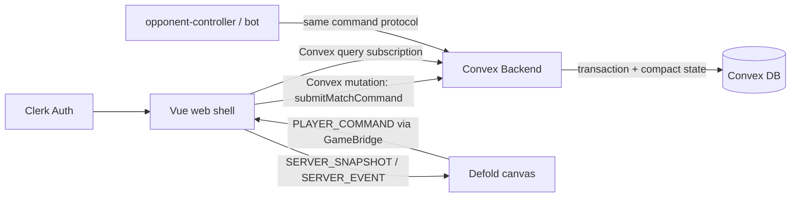

# Convex Implementation Plan

CylinderDicer는 서버 권위형 매치 원칙을 유지하되, 1차 제품 백엔드는 Convex 중심으로 구현한다. 단, Convex가 모든 프레임·미세 입력·연출 상태를 처리하지 않는다. 클라이언트는 입력 집계, 즉시 피드백, animation timeline, render cache를 담당하고 Convex는 판정 가능한 command checkpoint만 검증·반영한다.

Vue web shell이 Convex/Clerk SDK를 붙이고, Defold는 Vue `GameBridge`를 통해 command와 snapshot/delta만 주고받는다. Defold는 Convex client를 직접 들고 있지 않는다. 게임 판정, 난수, HP/총알/주사위 상태, 승패, 보상 반영은 Convex functions가 최종 권위를 가진다.

## Decision

### Adopt

- Convex database: profile, inventory, match metadata, participant index, compact authoritative state, event log, minimal snapshots.
- Convex functions:
  - `mutation`: command validation, authoritative state transition, event append, dirty snapshot/state write.
  - `query`: indexed lobby/match reads, minimal public view subscription, private view query.
  - `action`: later, external APIs or long-running side effects only.
- Clerk: web auth, guest/user login, later OAuth linking.
- Vue Convex client: Convex subscriptions and mutations.
- Defold GameBridge: `PLAYER_COMMAND`, `SERVER_SNAPSHOT`, `SERVER_EVENT`, `COMMAND_REJECTED`.
- Existing Defold `play/game/model/*` rules remain as local simulator until Convex port is ready.
- Client-side input aggregation: high-frequency local inputs are collapsed into one server command when the rule checkpoint is reached.

### Avoid

- Defold GUI scripts calling Convex directly.
- Defold deciding final match result.
- Vue/Defold writing authoritative match documents directly.
- Duplicating game rules permanently in both Lua and Convex.
- Treating client-side `availableActions` as authority. It is UX only.
- Sending animation frames, shake ticks, pointer positions, button repeat events, or transient HUD state to Convex.
- Writing full public + every private snapshot on every accepted command.
- Querying large tables with `.collect()` followed by client-side filtering in Convex functions.


## Architecture



Primary runtime path:

```text
Defold GUI input
  -> local input buffer / animation feedback
  -> when a rule checkpoint is reached, msg.post("/game#client_controller", "player_command", payload)
  -> Defold GameBridge emits PLAYER_COMMAND
  -> Vue receives PLAYER_COMMAND and attaches auth/session context
  -> Vue matchService.submitCommand()
  -> Convex mutation validates command transactionally
  -> Convex writes compact state + event + changed public/private view only
  -> Vue subscription/query receives minimal server view
  -> Vue sends SERVER_SNAPSHOT / SERVER_EVENT / COMMAND_REJECTED to Defold
  -> Defold render cache updates
  -> GUI render
```

High-frequency examples:

- Cup shake gesture: Defold/Vue count local shake motion and send one `shake.complete` command, not six `shake.roll` mutations.
- Count/face spinner repeat: client keeps local draft value and sends only final `bid.raise`.
- Duel animation: server returns ordered resolution steps once; Defold plays timing, easing, hit flashes, vibration, and camera effects locally.
- Pointer hover/drag, HUD open/close, disabled-button feedback: local only.

## Responsibility split

### Convex

Convex owns:

- match creation and participants
- seat/order
- turn/phase FSM
- dice roll RNG
- cylinder load/spin/trigger legality
- bid validation
- duel judge/resolution
- HP, elimination, winner
- command idempotency
- compact authoritative match state
- event log with retention policy
- minimal public view and private view derivation
- profile, inventory, season stats, rewards, ranking updates

Convex does not own:

- per-frame animation progress
- local shake gesture count below the server checkpoint
- count/face draft spinner state before submit
- camera/easing/vibration/hit flash timing
- transient HUD display state that can be derived from the latest server view

### Clerk

Clerk owns:

- login/session
- user identity
- provider linking
- JWT issuance for Convex authentication

Clerk identity must be mapped to a Convex `users` row.

### Vue

Vue owns:

- Clerk initialization
- Convex client initialization
- ConvexProvider/Convex client app context
- auth/session lifecycle
- lobby/match service wrappers
- minimal snapshot subscriptions
- command batching/debounce before Convex mutation
- Defold iframe bridge
- server view to Defold render-cache translation
- account/shop/inventory/ranking screens

### Defold

Defold owns:

- input collection
- local input aggregation for high-frequency actions
- animation/sound
- play HUD rendering
- local render cache
- command intent creation
- predicted/draft UI that is harmless if rejected

Defold does not own final state. It sends intent and renders server state.

## Cost-safe client/server split

Convex cost risk mostly comes from repeated function calls, DB I/O, storage growth, and subscription fan-out. The design therefore treats Convex as the authoritative referee, not as the animation loop.

### Server command granularity

Send one server command per rule checkpoint:

| UX action | Client responsibility | Convex command |
| --- | --- | --- |
| Cup shake motion | Count/animate local shake input until complete | `shake.complete` |
| Dice check reveal | Show local reveal affordance | `dice.check` |
| Count/face up/down | Maintain local draft bid | `bid.raise` only on submit |
| Bullet slot hover/click | Show local targeting feedback | `bullet.load` on chosen slot |
| Duel request | Button feedback and local pending state | `bid.challenge` |
| Duel animation | Play returned steps locally | `duel.execute`, then `round.advance` |

Legacy/local simulator code may still expose `shake.roll` for Defold tests, but Convex production flow should not send one mutation per shake tick.

### Snapshot policy

- Store one compact authoritative `matchStates` document per active match.
- Store one small public view if subscription fan-out needs it.
- Prefer deriving private view in query from authoritative state and current user, instead of materializing every player's full private snapshot every command.
- If private snapshots are materialized for MVP speed, write only the changed viewer/private row and keep it private-only. Do not copy the full public snapshot into every private snapshot.
- Do not accumulate duel animation history in the latest snapshot. Keep only the latest resolution or a short ring buffer needed for reconnect.

### Query policy

- Every lobby/match list query must use an index.
- Do not call `ctx.db.query("matches").collect()` and filter in memory.
- Use a `matchParticipants` table for user-to-match lookup.
- Use pagination for history, rankings, inventory logs, and completed matches.

### Retention policy

- Dev matches are reusable or short-lived.
- Complete match command/event logs are compacted into a summary after the replay/debug window.
- `matchCommands` idempotency records are kept for a bounded window, not forever.
- QA automation should use Convex local deployments by default.

## Suggested directory

```text
convex/
  auth.config.ts
  schema.ts
  users.ts
  matches.ts
  commands.ts
  snapshots.ts
  match/
    state.ts
    actions.ts
    reducer.ts
    rulesBidding.ts
    rulesCylinder.ts
    rulesDice.ts
    rulesDuel.ts
    turnMachine.ts
    snapshots.ts
  protocol/
    commands.ts
    snapshots.ts
    errors.ts

web/src/services/convex/
  convexClient.ts
  authService.ts
  matchService.ts
  profileService.ts
  inventoryService.ts
  rankingService.ts
  errors.ts
```

The `convex/match/*` modules should be pure TypeScript domain logic. They should not import Vue, Defold, or DOM code.

## Package dependencies

Root or `web/` needs the frontend packages depending on where the Vue app is installed. Current Vue app lives in `web/`, so start there:

```bash
cd web
npm install convex convex-vue @clerk/vue
```

Convex backend package/CLI can be invoked with `npx convex dev`. If a root `package.json` is introduced later, move shared scripts there.

Note: `convex-vue` and `@convex-vue/core` both exist. The attached local manual uses the `convex-vue` plugin style, so this plan starts there. Keep Convex usage behind `web/src/services/convex/` so the package can be swapped if needed.

## Environment variables

### `web/.env.local`

Vite exposes only `VITE_` variables to browser code. These values are client config, not admin secrets.

```env
VITE_CONVEX_URL=https://<your-convex-deployment>.convex.cloud
VITE_CLERK_PUBLISHABLE_KEY=pk_test_xxxxxxxxxxxxxxxxx
```

Optional local flags:

```env
VITE_USE_CONVEX_DEV=true
VITE_USE_LOCAL_DEFOLD_SIMULATOR=false
```

### `web/.env.example`

Commit this template:

```env
VITE_CONVEX_URL=
VITE_CLERK_PUBLISHABLE_KEY=
VITE_USE_CONVEX_DEV=true
VITE_USE_LOCAL_DEFOLD_SIMULATOR=false
```

### Convex deployment environment

Convex backend functions need the Clerk issuer domain. This is not a Vite/browser variable.

Set it in Convex dashboard environment variables or with Convex CLI:

```env
CLERK_JWT_ISSUER_DOMAIN=https://<your-clerk-frontend-api-url>
```

Depending on the exact Clerk/Convex auth config we choose, this may also be named:

```env
CLERK_FRONTEND_API_URL=https://<your-clerk-frontend-api-url>
```

Use one canonical name in `convex/auth.config.ts`. Prefer `CLERK_JWT_ISSUER_DOMAIN` because it matches the existing local manual and common Convex Clerk templates.

### Convex CLI generated env

`npx convex dev` commonly writes local Convex deployment metadata for the project. Do not hand-edit generated deployment markers unless the CLI asks.

Expected local values may include:

```env
CONVEX_DEPLOYMENT=
VITE_CONVEX_URL=
```

`VITE_CONVEX_URL` is for the browser. `CONVEX_DEPLOYMENT` is for the Convex CLI to know which deployment it is talking to.

## `.gitignore` requirements

Add before creating local env files:

```gitignore
.env
.env.*
!.env.example
web/.env
web/.env.*
!web/.env.example
convex/.env
convex/.env.*
!convex/.env.example
```

Never commit:

- Clerk secret key
- Convex deploy key
- service account JSON
- production-only API secrets
- payment provider secrets

`VITE_CLERK_PUBLISHABLE_KEY` and `VITE_CONVEX_URL` are publishable client config, but still keep actual local env values out of git.

## Clerk setup

1. Create a Clerk application.
2. Enable the desired sign-in methods.
3. Copy the Publishable Key into `web/.env.local`:

```env
VITE_CLERK_PUBLISHABLE_KEY=pk_test_...
```

4. In Clerk dashboard, create a JWT template for Convex.
5. Copy the issuer/frontend API URL.
6. Set that URL in Convex deployment env:

```bash
npx convex env set CLERK_JWT_ISSUER_DOMAIN https://<issuer>.clerk.accounts.dev
```

The exact dashboard path can differ by Clerk UI version. Look for API keys, Frontend API URL, or JWT Templates.

## Convex auth config

Create:

```text
convex/auth.config.ts
```

Shape:

```ts
export default {
  providers: [
    {
      domain: process.env.CLERK_JWT_ISSUER_DOMAIN,
      applicationID: "convex",
    },
  ],
};
```

This tells Convex to accept Clerk JWTs issued for the Convex template.

## Initial Convex schema draft

```ts
import { defineSchema, defineTable } from "convex/server";
import { v } from "convex/values";

export default defineSchema({
  users: defineTable({
    clerkId: v.string(),
    displayName: v.optional(v.string()),
    createdAt: v.number(),
    updatedAt: v.number(),
  }).index("by_clerk_id", ["clerkId"]),

  inventories: defineTable({
    userId: v.id("users"),
    currencies: v.object({
      coins: v.number(),
      gems: v.number(),
    }),
    equipped: v.object({
      diceSkin: v.string(),
      cupSkin: v.string(),
    }),
    revision: v.number(),
    updatedAt: v.number(),
  }).index("by_user", ["userId"]),

  matches: defineTable({
    mode: v.union(v.literal("dev"), v.literal("casual"), v.literal("ranked")),
    status: v.union(v.literal("ready"), v.literal("complete")),
    revision: v.number(),
    hostUserId: v.optional(v.id("users")),
    createdAt: v.number(),
    updatedAt: v.number(),
  }).index("by_status", ["status"]),

  matchParticipants: defineTable({
    matchId: v.id("matches"),
    userId: v.id("users"),
    playerId: v.string(),
    seatIndex: v.number(),
    status: v.union(v.literal("active"), v.literal("left"), v.literal("complete")),
    updatedAt: v.number(),
  })
    .index("by_match", ["matchId"])
    .index("by_user_status", ["userId", "status"])
    .index("by_match_user", ["matchId", "userId"]),

  matchStates: defineTable({
    matchId: v.id("matches"),
    revision: v.number(),
    state: v.any(),
    updatedAt: v.number(),
  }).index("by_match", ["matchId"]),

  matchEvents: defineTable({
    matchId: v.id("matches"),
    revision: v.number(),
    type: v.string(),
    actorUserId: v.optional(v.id("users")),
    payload: v.any(),
    createdAt: v.number(),
  }).index("by_match_revision", ["matchId", "revision"]),

  matchCommands: defineTable({
    matchId: v.id("matches"),
    commandId: v.string(),
    actorUserId: v.id("users"),
    type: v.string(),
    payload: v.any(),
    resultRevision: v.optional(v.number()),
    createdAt: v.number(),
  })
    .index("by_match_command", ["matchId", "commandId"])
    .index("by_match_actor", ["matchId", "actorUserId"]),

  matchSnapshots: defineTable({
    matchId: v.id("matches"),
    userId: v.optional(v.id("users")),
    kind: v.union(v.literal("public"), v.literal("private_delta")),
    revision: v.number(),
    snapshot: v.any(),
    updatedAt: v.number(),
  })
    .index("by_match_kind", ["matchId", "kind"])
    .index("by_match_user", ["matchId", "userId"]),
});
```

This is intentionally broad for the first slice, but `v.any()` is not a long-term contract. Tighten payload/state/snapshot validators as soon as the command protocol stabilizes, and add size guards before public QA or production playtests.

Important cost constraints:

- `matchParticipants` is the only supported way to list a user's matches. Do not scan `matches`.
- `matchStates` stores compact authoritative state, not render history.
- `matchSnapshots.private_delta` must contain private-only fields. It must not duplicate the full public snapshot for every player.
- `matchEvents` and `matchCommands` need retention/compaction before production.

## Command protocol

Defold and QA tools submit intent.

```ts
type MatchCommand = {
  commandId: string;
  matchId: string;
  actorUserId: string;
  revision: number;
  type:
    | "setup.load_initial"
    | "shake.complete"
    | "dice.check"
    | "bidding.open"
    | "bullet.load"
    | "bid.raise"
    | "bid.challenge"
    | "duel.execute"
    | "round.advance";
  payload?: unknown;
};
```

`shake.roll` may remain in the local Defold simulator and Lua tests, but Convex production protocol should use `shake.complete`.

Clients never submit:

- dice results
- duel judge result
- damage result
- winner
- reward amount
- repeated shake ticks
- pointer/hover/animation progress

## Core functions draft

```text
convex/users.ts
  getCurrentUser
  createOrUpdateCurrentUser

convex/matches.ts
  createDevMatch
  listMyMatches
  getPublicSnapshot
  getPrivateDelta

convex/commands.ts
  submitMatchCommand
```

`submitMatchCommand` is the heart of the authoritative path:

```text
validate auth
validate actor belongs to match
dedupe commandId
load latest match state/snapshot
validate command against current phase/turn
apply reducer
append event(s)
write compact match state
write public view only when changed
write private delta only for affected viewers when needed
return accepted/rejected result
```

## Vue integration target

### `web/src/main.ts`

Target shape:

```ts
import { createApp } from "vue";
import { clerkPlugin } from "@clerk/vue";
import { convexVue } from "convex-vue";

createApp(App)
  .use(clerkPlugin, {
    publishableKey: import.meta.env.VITE_CLERK_PUBLISHABLE_KEY,
  })
  .use(convexVue, {
    url: import.meta.env.VITE_CONVEX_URL,
  })
  .mount("#app");
```

If the Vue Convex package API differs, isolate it behind `web/src/services/convex/convexClient.ts` so the rest of the app does not care.

### `matchService`

```ts
createDevMatch()
submitCommand(command)
usePublicView(matchId)
getPrivateView(matchId) or usePrivateDelta(matchId)
```

`DefoldCanvas.vue` should not import Convex directly. It should receive service callbacks or emit `PLAYER_COMMAND` to a parent that calls `matchService`.

`matchService` also owns client-side command shaping:

- debounce or collapse repeated UI inputs.
- convert local shake progress into one `shake.complete`.
- attach `commandId` and current revision.
- reject obviously impossible local drafts before network calls, while still treating server rejection as final.
- unsubscribe from match views when leaving the play screen.

## Defold bridge messages

Extend `shared/protocol/game-bridge.ts`:

```ts
export type GameBridgeMessageType =
  | "DEFOLD_READY"
  | "START_MATCH"
  | "MATCH_READY"
  | "PLAYER_COMMAND"
  | "SERVER_SNAPSHOT"
  | "SERVER_EVENT"
  | "COMMAND_REJECTED"
  | "SET_COSMETICS"
  | "COSMETICS_APPLIED"
  | "PING"
  | "PONG"
  | "UNKNOWN_MESSAGE";
```

Defold migration rule:

- GUI scripts stop requiring `game.model.actions`.
- GUI scripts stop dispatching store actions directly.
- GUI scripts send messages to `client_controller.script`.
- `client_controller.script` emits `PLAYER_COMMAND` through GameBridge.
- Existing local reducer/store remains as dev simulator until Convex loop is ready.

## QA migration

Current QA path:

```text
opponent-controller / bot
  -> vertual-server
  -> /tmp/cylinderdicer_qa_commands.txt
  -> Defold local store
```

Target QA path:

```text
opponent-controller / bot
  -> Convex mutation submitMatchCommand
  -> Convex authoritative state
  -> Vue/Defold snapshot subscription
```

Keep `vertual-server/` as legacy fallback until the Convex dev match flow can drive all opponent actions.

For cost safety, QA automation should prefer local Convex deployments and should not spam production deployments with shake ticks or repeated polling. Opponent tools should send the same checkpoint-level commands as the real client.

## Testing plan

### Convex unit/domain tests

Port the current Lua model tests from `play/game/model/tests/model_flow_test.lua`:

- setup and first shake
- bid and challenge
- SHORT/OVER/EXACT duel
- challenger starts next bidding round
- eliminated challenger falls forward to next seat
- duel bullet spender reloads after next shake
- local/opponent permissions

### Convex integration tests

- Clerk-authenticated user can create profile.
- User can create dev match.
- Legal command appends event and updates snapshot.
- `shake.complete` is one mutation per completed shake, not one mutation per shake tick.
- Illegal command returns structured rejection.
- Duplicate `commandId` is idempotent.
- Private snapshot hides opponent dice/cylinder.
- `listMyMatches` uses `matchParticipants.by_user_status`, not `matches.collect()`.
- Completed dev matches can be cleaned up or compacted.

### Defold/Vue bridge tests

- Defold emits `PLAYER_COMMAND`.
- Vue submits Convex mutation.
- Convex snapshot subscription updates.
- Vue sends `SERVER_SNAPSHOT`.
- Defold render cache updates without local rule execution.
- Defold can play duel/reload/shake animations locally from one server resolution payload.

## Migration phases

### Phase 1: project setup

- Install Convex/Clerk packages in `web/`.
- Add `.env.example` and `.gitignore` protection.
- Run `npx convex dev` and initialize `convex/`.
- Add `convex/auth.config.ts`.
- Add initial schema.

### Phase 2: protocol

- Extend `shared/protocol/game-bridge.ts`.
- Add shared command/snapshot/event types.
- Keep existing `START_MATCH` until bridge migration is complete.
- Define client aggregation rules: `shake.complete`, final `bid.raise`, final `bullet.load`.

### Phase 3: auth/profile

- Wire Clerk in Vue.
- Create `users` row from Clerk identity.
- Add `inventory` default state.

### Phase 4: match authority

- Port match rules from Lua to Convex TypeScript.
- Implement `createDevMatch`.
- Implement `submitMatchCommand`.
- Write compact authoritative state.
- Write minimal public view and private-only delta/view.
- Add `matchParticipants` and indexed match listing.

### Phase 5: Defold adapter

- Add `client_controller.script`.
- Convert GUI direct dispatch paths to messages.
- Add server snapshot render cache.
- Keep local simulator behind dev flag.

### Phase 6: QA tools

- Point opponent tools to Convex dev deployment.
- Preserve legacy `vertual-server/` only for local Defold simulator mode.
- Run high-volume QA against Convex local deployment by default.
- Make opponent tools submit checkpoint-level commands only.

### Phase 7: hardening

- command rate limits
- payload size limits
- event/command retention and compaction
- reconnect/resync
- idempotency tests
- seed commit/reveal policy
- logging/analytics
- deployment split for dev/production
- cost dashboard review before public test

## Open questions

- Use Clerk for MVP auth, or start with Convex Auth and add Clerk later?
- Do we use `convex-vue` directly, or wrap Convex React-like APIs through a small service layer?
- Should casual/dev matches allow local simulator fallback while ranked always requires Convex?
- Which private data should be derived on query vs materialized as private deltas?
- Do opponent bots run as external clients or Convex scheduled/internal actions?
- How long do we retain full command/event replay for dev, casual, and ranked matches?
- Which UI states deserve optimistic client prediction, and which must wait for server acceptance?

## Non-goals

- Do not port rendering to Convex.
- Do not add Defold native Convex access.
- Do not remove local Defold simulator before Convex dev match covers the full loop.
- Do not trust Defold/Vue for rewards, ranking, dice, duel, or winner.
- Do not use Convex as a frame/event stream for animation.
- Do not optimize by making clients authoritative for any irreversible result.
