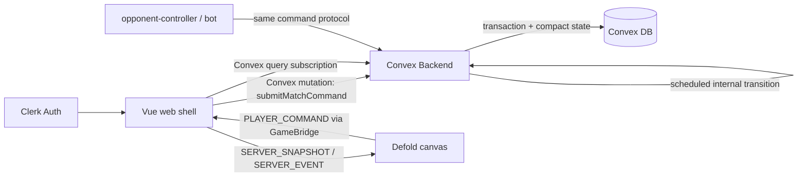

# Convex Implementation Plan

CylinderDicer는 서버 권위형 매치 원칙을 유지하되, 1차 제품 백엔드는 Convex 중심으로 구현한다. 단, Convex가 모든 프레임·미세 입력·연출 상태를 처리하지 않는다. 클라이언트는 입력 집계, 즉시 피드백, animation timeline, render cache를 담당하고 Convex는 판정 가능한 command checkpoint만 검증·반영한다.

Vue web shell이 Convex/Clerk SDK를 붙이고, Defold는 Vue `GameBridge`를 통해 command와 snapshot/delta만 주고받는다. Defold는 Convex client를 직접 들고 있지 않는다. 게임 판정, 난수, HP/총알/주사위 상태, 승패, 보상 반영은 Convex functions가 최종 권위를 가진다.

## Decision

### Adopt

- Convex database: profile, inventory, match metadata, participant index, compact authoritative state, event log, minimal snapshots.
- Convex functions:
  - `mutation`: command validation, authoritative state transition, event append, dirty snapshot/state write.
  - `query`: indexed lobby/match reads, minimal public view subscription, private view query.
  - `action`: later, external APIs or long-running side effects only.
- Clerk: web auth, guest/user login, later OAuth linking.
- Vue Convex client: Convex subscriptions and mutations.
- Defold GameBridge: `PLAYER_COMMAND`, `SERVER_SNAPSHOT`, `SERVER_EVENT`, `COMMAND_REJECTED`.
- Existing Defold `play/game/model/*` rules remain as local simulator until Convex port is ready.
- Client-side input aggregation: high-frequency local inputs are collapsed into one server command when the rule checkpoint is reached.

### Avoid

- Defold GUI scripts calling Convex directly.
- Defold deciding final match result.
- Vue/Defold writing authoritative match documents directly.
- Duplicating game rules permanently in both Lua and Convex.
- Treating client-side `availableActions` as authority. It is UX only.
- Sending animation frames, shake ticks, pointer positions, button repeat events, or transient HUD state to Convex.
- Writing full public + every private snapshot on every accepted command.
- Querying large tables with `.collect()` followed by client-side filtering in Convex functions.


## Architecture



Primary runtime path:

```text
Defold GUI input
  -> local input buffer / animation feedback
  -> when a rule checkpoint is reached, msg.post("/game#client_controller", "player_command", payload)
  -> Defold GameBridge emits PLAYER_COMMAND
  -> Vue receives PLAYER_COMMAND and attaches auth/session context
  -> Vue matchService.submitCommand()
  -> Convex mutation validates command transactionally
  -> Convex writes compact state + event + changed public/private view only
  -> Vue subscription/query receives minimal server view
  -> Vue sends SERVER_SNAPSHOT / SERVER_EVENT / COMMAND_REJECTED to Defold
  -> Defold render cache updates
  -> GUI render
```

High-frequency examples:

- Cup shake gesture: Defold/Vue maintain a bounded local gauge and send one `shake.complete` command at 100; no per-tick mutation exists.
- Count/face spinner repeat: client keeps local draft value and sends only final `bid.raise`.
- Duel animation: server returns ordered resolution steps once; Defold plays timing, easing, hit flashes, vibration, and camera effects locally.
- SHORT/OVER duel ownership: verdict는 `actual - bid` 기준이다. `SHORT`에서는 challenger가 previous bidder를, `OVER`에서는 previous bidder가 challenger를 공격한다. 각 step의 `shooterId`와 `rouletteSubjectId`는 공격자 및 소모할 실린더를, `targetId`는 HP가 감소할 피격자를 뜻한다.
- Delayed phase progression: Convex schedules `bidding.open`, `bid.reload_timeout`, `duel.execute`, and `round.advance`; clients render the resulting phase and animation timeline.
- Pointer hover/drag, HUD open/close, disabled-button feedback: local only.

## Responsibility split

### Convex

Convex owns:

- Ladder queue lease lifecycle, adaptive 2–6 player match formation, and stable Ladder stat summaries
- match creation and participants
- seat/order
- turn/phase FSM
- delayed automatic progression with phase/revision/epoch guards
- dice roll RNG
- cylinder load/spin/trigger legality
- bid validation
- duel judge/resolution
- HP, elimination, winner
- command idempotency
- compact authoritative match state
- event log with retention policy
- minimal public view and private view derivation
- profile, inventory, season stats, rewards, ranking updates

Convex does not own:

- per-frame animation progress
- local shake gesture count below the server checkpoint
- count/face draft spinner state before submit
- camera/easing/vibration/hit flash timing
- transient HUD display state that can be derived from the latest server view

### Clerk

Clerk owns:

- login/session
- user identity
- provider linking
- JWT issuance for Convex authentication

Clerk identity must be mapped to a Convex `users` row.

### Vue

Vue owns:

- Clerk initialization
- Convex client initialization
- ConvexProvider/Convex client app context
- auth/session lifecycle
- lobby/match service wrappers
- minimal snapshot subscriptions
- command batching/debounce before Convex mutation
- Defold iframe bridge
- server view to Defold render-cache translation
- account/shop/inventory/ranking screens

### Defold

Defold owns:

- input collection
- local input aggregation for high-frequency actions
- animation/sound
- play HUD rendering
- local render cache
- command intent creation
- predicted/draft UI that is harmless if rejected

Defold does not own final state. It sends intent and renders server state.

HUD scripts also do not own phase progression. Convex-backed play advances through internal scheduled mutations. The standalone local simulator mirrors that contract in `play/game/flow_coordinator.script`; `director.script` consumes only the descriptor returned by `play/game/presentation.lua`.

## Cost-safe client/server split

Convex cost risk mostly comes from repeated function calls, DB I/O, storage growth, and subscription fan-out. The design therefore treats Convex as the authoritative referee, not as the animation loop.

### Server command granularity

Send one server command per rule checkpoint:

| UX action | Client responsibility | Convex command |
| --- | --- | --- |
| Cup shake motion | 0–100 local gauge (`+24/input`, `-12/second`)를 animate하고 100에서 완료 | `shake.complete` |
| Dice check reveal | Show local reveal affordance | `dice.check` |
| Count/face up/down | Maintain local draft bid | `bid.raise` only on submit |
| Bullet slot hover/click | Show local targeting feedback | `bullet.load` on chosen slot |
| Duel request | Button feedback and local pending state | `bid.challenge` |
| Duel animation | Play returned steps locally | none; server schedules execute/advance |

Shake tick과 local gauge 값은 Convex state/snapshot에 저장하지 않는다. Defold local simulator도 같은 checkpoint-level `shake.complete`와 phase-level `shake.timeout` action을 사용한다.

### Snapshot policy

- Store one compact authoritative `matchStates` document per active match.
- Store one small public view if subscription fan-out needs it.
- Prefer deriving private view in query from authoritative state and current user, instead of materializing every player's full private snapshot every command.
- If private snapshots are materialized for MVP speed, write only the changed viewer/private row and keep it private-only. Do not copy the full public snapshot into every private snapshot.
- Do not accumulate duel animation history in the latest snapshot. Keep only the latest resolution or a short ring buffer needed for reconnect.

### Query policy

- Every lobby/match list query must use an index.
- Do not call `ctx.db.query("matches").collect()` and filter in memory.
- Use a `matchParticipants` table for user-to-match lookup.
- Use pagination for history, rankings, inventory logs, and completed matches.

### Retention policy

- Dev matches are reusable or short-lived.
- Complete match command/event logs are compacted into a summary after the replay/debug window.
- `matchCommands` idempotency records are kept for a bounded window, not forever.
- QA automation should use Convex local deployments by default.

## Suggested directory

```text
convex/
  auth.config.ts
  convex.config.ts
  schema.ts
  users.ts
  ladder.ts
  matches.ts
  commands.ts
  snapshots.ts
  match/
    state.ts
    actions.ts
    reducer.ts
    rulesBidding.ts
    rulesCylinder.ts
    rulesDice.ts
    rulesDuel.ts
    turnMachine.ts
    snapshots.ts
  protocol/
    commands.ts
    snapshots.ts
    errors.ts

web/src/services/convex/
  convexClient.ts
  authService.ts
  matchService.ts
  profileService.ts
  inventoryService.ts
  rankingService.ts
  ladderService.ts
  errors.ts
```

The `convex/match/*` modules should be pure TypeScript domain logic. They should not import Vue, Defold, or DOM code.

## Package dependencies

Root or `web/` needs the frontend packages depending on where the Vue app is installed. Current Vue app lives in `web/`, so start there:

```bash
cd web
npm install convex convex-vue @clerk/vue
```

Convex backend package/CLI can be invoked with `npx convex dev`. If a root `package.json` is introduced later, move shared scripts there.

Note: `convex-vue` and `@convex-vue/core` both exist. The attached local manual uses the `convex-vue` plugin style, so this plan starts there. Keep Convex usage behind `web/src/services/convex/` so the package can be swapped if needed.

Current root scripts:

```bash
npm run convex:typecheck
npm run convex:domain-test
npm run phase0:test
npm run phase1:check
CONVEX_DEPLOYMENT_REF=<team_slug>:<project_slug>:<deployment_ref> npm run phase1:bootstrap
```

`phase1:check` is a non-secret preflight. It verifies that Convex source files, deployment selection, generated API files, web client env, and generated API frontend references are present.

`phase1:bootstrap` selects an existing Convex deployment, syncs generated `CONVEX_URL` into `web/.env.local` as `VITE_CONVEX_URL`, optionally sets `CLERK_JWT_ISSUER_DOMAIN`, then runs `phase1:check`. It does not create a new Convex project unless `CONVEX_ALLOW_CREATE=1` is explicitly set.

## Environment variables

### `web/.env.local`

Vite exposes only `VITE_` variables to browser code. These values are client config, not admin secrets.

```env
VITE_CONVEX_URL=https://<your-convex-deployment>.convex.cloud
VITE_CLERK_PUBLISHABLE_KEY=pk_test_xxxxxxxxxxxxxxxxx
```

Optional local flags:

```env
VITE_USE_CONVEX_DEV=true
VITE_USE_LOCAL_DEFOLD_SIMULATOR=false
```

### `web/.env.example`

Commit this template:

```env
VITE_CONVEX_URL=
VITE_CLERK_PUBLISHABLE_KEY=
VITE_USE_CONVEX_DEV=true
VITE_USE_LOCAL_DEFOLD_SIMULATOR=false
```

### Convex deployment environment

Convex backend functions need the Clerk issuer domain. This is not a Vite/browser variable.

Set it in Convex dashboard environment variables or with Convex CLI:

```env
CLERK_JWT_ISSUER_DOMAIN=https://<your-clerk-frontend-api-url>
```

Depending on the exact Clerk/Convex auth config we choose, this may also be named:

```env
CLERK_FRONTEND_API_URL=https://<your-clerk-frontend-api-url>
```

Use one canonical name in `convex/auth.config.ts`. Prefer `CLERK_JWT_ISSUER_DOMAIN` because it matches the existing local manual and common Convex Clerk templates.

### Convex CLI generated env

`npx convex dev` commonly writes local Convex deployment metadata for the project. The first run may require an interactive terminal because the CLI needs a Convex team/project selection. Do not hand-edit generated deployment markers unless the CLI asks.

Expected local values may include:

```env
CONVEX_DEPLOYMENT=
CONVEX_URL=
CONVEX_SITE_URL=
```

`CONVEX_DEPLOYMENT` is for the Convex CLI to know which deployment it is talking to. `CONVEX_URL` is the deployment URL. Copy the same URL into `web/.env.local` as `VITE_CONVEX_URL` so browser code can initialize the Convex client.

Recommended Phase 1 setup sequence:

```bash
npm run phase0:test
CONVEX_DEPLOYMENT_REF=<team_slug>:<project_slug>:<deployment_ref> CLERK_JWT_ISSUER_DOMAIN=https://<issuer>.clerk.accounts.dev npm run phase1:bootstrap
npm run phase1:check
```

If the Convex account has multiple teams, select an existing deployment explicitly:

```bash
npx convex login status
CONVEX_DEPLOYMENT_REF=<team_slug>:<project_slug>:<deployment_ref> npm run phase1:bootstrap
```

Manual equivalent:

```bash
npx convex deployment select <team_slug>:<project_slug>:<deployment_ref>
npx convex dev --once
npx convex env set CLERK_JWT_ISSUER_DOMAIN https://<issuer>.clerk.accounts.dev
# copy root CONVEX_URL into web/.env.local as VITE_CONVEX_URL
npm run phase1:check
```

If the project already exists, use `--configure existing` or select an existing deployment:

```bash
npx convex deployment select <team_slug>:<project_slug>:local
npm run convex:codegen
npm run phase1:check
```

Frontend services should use generated API references through one registry:

```ts
import { api } from "../../../../convex/_generated/api";
```

Current frontend code keeps generated references in one registry:

```text
web/src/services/convex/functionReferences.ts
```

This is the intended frontend access point for generated Convex API references. Service files should not import `makeFunctionReference(...)` directly.

Important: `npm run convex:codegen` verifies and regenerates generated API references. Do not treat it as the canonical deployment step for schema/functions. Before manual E2E on MossBorg dev, confirm functions/schema are pushed with `npm run phase1:bootstrap` or `npx convex dev --once`.

## `.gitignore` requirements

Add before creating local env files:

```gitignore
.env
.env.*
!.env.example
web/.env
web/.env.*
!web/.env.example
convex/.env
convex/.env.*
!convex/.env.example
```

Never commit:

- Clerk secret key
- Convex deploy key
- service account JSON
- production-only API secrets
- payment provider secrets

`VITE_CLERK_PUBLISHABLE_KEY` and `VITE_CONVEX_URL` are publishable client config, but still keep actual local env values out of git.

## Clerk setup

1. Create a Clerk application.
2. Enable the desired sign-in methods.
3. Copy the Publishable Key into `web/.env.local`:

```env
VITE_CLERK_PUBLISHABLE_KEY=pk_test_...
```

4. In Clerk dashboard, create a JWT template for Convex.
5. Copy the issuer/frontend API URL.
6. Set that URL in Convex deployment env:

```bash
npx convex env set CLERK_JWT_ISSUER_DOMAIN https://<issuer>.clerk.accounts.dev
```

The exact dashboard path can differ by Clerk UI version. Look for API keys, Frontend API URL, or JWT Templates.

### Clerk admin claim for opponent controller

For the operator-facing `/admin/opponents` usage guide, see [Opponent Controller Runbook](./OPPONENT_CONTROLLER.md).

The Phase 4 admin opponent controller checks custom claims on the Clerk JWT identity returned by `ctx.auth.getUserIdentity()`. For the current implementation in `convex/adminMatches.ts`, the simplest Convex JWT template claim is:

```json
{
  "role": "admin"
}
```

Another accepted shape is:

```json
{
  "roles": ["admin"]
}
```

The guard also accepts admin-like values in these keys, including nested metadata objects:

- `role`
- `roles`
- `permission`
- `permissions`
- `org_role`
- `organizationRole`
- `organization_role`
- `metadata`
- `publicMetadata`
- `public_metadata`
- `privateMetadata`
- `private_metadata`
- `unsafeMetadata`
- `unsafe_metadata`
- `claims`
- `authorization`

Boolean admin flags are also accepted:

- `admin`
- `isAdmin`
- `is_admin`
- `cylinderdicerAdmin`
- `cylinderdicer_admin`

After editing the Clerk JWT template, sign out and sign back in so Clerk issues a fresh token. To verify the claim reaches Convex:

1. Sign in to the web app.
2. Open `/admin/opponents`.
3. Confirm the header shows **Admin access granted** (backed by `adminMatches.probeAdminAccess`).
4. If access is denied, the UI shows the missing-claim hint and the Convex query returns `UNAUTHORIZED`.

CLI verification:

```bash
npm run phase4:deploy   # push schema/functions: npx convex dev --once
npm run phase4:check    # local + live deployment admin function preflight
```

Do not leave a permanent identity-dump query in production. `probeAdminAccess` only returns authorization status, not the full JWT payload.

## Convex auth config

Create:

```text
convex/auth.config.ts
```

Shape:

```ts
export default {
  providers: [
    {
      domain: process.env.CLERK_JWT_ISSUER_DOMAIN,
      applicationID: "convex",
    },
  ],
};
```

This tells Convex to accept Clerk JWTs issued for the Convex template.

## Initial Convex schema draft

```ts
import { defineSchema, defineTable } from "convex/server";
import { v } from "convex/values";

export default defineSchema({
  users: defineTable({
    clerkId: v.string(),
    displayName: v.optional(v.string()),
    createdAt: v.number(),
    updatedAt: v.number(),
  }).index("by_clerk_id", ["clerkId"]),

  inventories: defineTable({
    userId: v.id("users"),
    currencies: v.object({
      coins: v.number(),
      gems: v.number(),
    }),
    equipped: v.object({
      diceSkin: v.string(),
      cupSkin: v.string(),
    }),
    revision: v.number(),
    updatedAt: v.number(),
  }).index("by_user", ["userId"]),

  matches: defineTable({
    mode: v.union(v.literal("dev"), v.literal("casual"), v.literal("ranked")),
    status: v.union(v.literal("ready"), v.literal("complete")),
    revision: v.number(),
    hostUserId: v.optional(v.id("users")),
    createdAt: v.number(),
    updatedAt: v.number(),
  }).index("by_status", ["status"]),

  matchParticipants: defineTable({
    matchId: v.id("matches"),
    userId: v.id("users"),
    playerId: v.string(),
    seatIndex: v.number(),
    status: v.union(v.literal("active"), v.literal("left"), v.literal("complete")),
    updatedAt: v.number(),
  })
    .index("by_match", ["matchId"])
    .index("by_user_status", ["userId", "status"])
    .index("by_match_user", ["matchId", "userId"]),

  matchStates: defineTable({
    matchId: v.id("matches"),
    revision: v.number(),
    state: v.any(),
    updatedAt: v.number(),
  }).index("by_match", ["matchId"]),

  matchEvents: defineTable({
    matchId: v.id("matches"),
    revision: v.number(),
    type: v.string(),
    actorUserId: v.optional(v.id("users")),
    payload: v.any(),
    createdAt: v.number(),
  }).index("by_match_revision", ["matchId", "revision"]),

  matchCommands: defineTable({
    matchId: v.id("matches"),
    commandId: v.string(),
    actorUserId: v.id("users"),
    type: v.string(),
    payload: v.any(),
    resultRevision: v.optional(v.number()),
    createdAt: v.number(),
  })
    .index("by_match_command", ["matchId", "commandId"])
    .index("by_match_actor", ["matchId", "actorUserId"]),

  matchSnapshots: defineTable({
    matchId: v.id("matches"),
    userId: v.optional(v.id("users")),
    kind: v.union(v.literal("public"), v.literal("private_delta")),
    revision: v.number(),
    snapshot: v.any(),
    updatedAt: v.number(),
  })
    .index("by_match_kind", ["matchId", "kind"])
    .index("by_match_user", ["matchId", "userId"]),
});
```

This is intentionally broad for the first slice, but `v.any()` is not a long-term contract. Tighten payload/state/snapshot validators as soon as the command protocol stabilizes, and add size guards before public QA or production playtests.

Important cost constraints:

- `matchParticipants` is the only supported way to list a user's matches. Do not scan `matches`.
- `matchStates` stores compact authoritative state, not render history.
- `matchSnapshots.private_delta` must contain private-only fields. It must not duplicate the full public snapshot for every player.
- `matchEvents` and `matchCommands` need retention/compaction before production.

## Command protocol

Defold and QA tools submit intent.

```ts
type MatchCommand = {
  commandId: string;
  matchId: string;
  actorUserId: string;
  revision: number;
  type:
    | "setup.load_initial"
    | "shake.complete"
    | "dice.check"
    | "bullet.load"
    | "bid.raise"
    | "bid.challenge";
  payload?: unknown;
};
```

Defold local simulator and Convex production both use `shake.complete`; `shake.roll` is no longer part of the active domain protocol.

`bidding.open`, `bid.reload_timeout`, `duel.execute`, and `round.advance` are reducer actions used only by the automatic progression layer. `convex/match/flow.ts` derives a delay and guard token from authoritative state; `matchFlow:advanceMatchFlow` applies the action only when phase, revision, and flow epoch still match. Public player and admin validators do not accept these actions.

Bid reloads are pipelined inside the authoritative `bidding` phase. `pendingLoad` is the player currently loading, while `bidding.deferredLoad` holds at most one reload created by the next accepted bid. Before that next bid, the active player may bid while the previous loader acts; challenge remains unavailable until the reload queue is empty. If the next bid arrives first, `bidding.reloadGate` freezes further bidding for three seconds and is projected publicly for the loader countdown/loading-wheel HUD. The guarded `bid.reload_timeout` loads the current player's first empty slot and promotes `deferredLoad`; a manual load changes revision and invalidates the scheduled timeout.

A face-1 Skull `bid.raise` is still a single player intent, but the authoritative reducer resolves a self Russian-roulette attempt before accepting it. Convex derives the spin from match RNG, triggers the bidder's own cylinder once, consumes any fired bullet, and applies one HP damage on a hit. A surviving bidder's Skull bid is accepted and enters the normal bid-reload pipeline. A lethal attempt is rejected without replacing the prior `currentBid`; the eliminated bidder is skipped, or the match completes when one player remains. The public snapshot projects `bidding.skullRoulette` with a monotonic sequence and the hit/HP outcome so Defold can animate the affected portrait without client-authored damage.

Scheduler payloads contain only `matchId`, transition type, expected phase, expected revision, and expected epoch. Timing metadata such as `delayMs` is used by `runAfter` but is not passed to the internal mutation validator. The web reconnect path calls `resumeMatchFlow`, which only re-schedules the guarded internal transition; it never applies phase changes directly.

Clients never submit:

- dice results
- duel judge result
- damage result
- winner
- reward amount
- repeated shake ticks
- pointer/hover/animation progress

## Core functions draft

```text
convex/users.ts
  getCurrentUser
  createOrUpdateCurrentUser

convex/matches.ts
  createDevMatch
  listMyMatches
  getPublicSnapshot
  getPrivateDelta

convex/commands.ts
  submitMatchCommand

convex/matchFlow.ts
  advanceMatchFlow (internal scheduled mutation)
```

`submitMatchCommand` is the heart of the authoritative path:

```text
validate auth
validate actor belongs to match
dedupe commandId
load latest match state/snapshot
validate command against current phase/turn
apply reducer
append event(s)
write compact match state
write public view only when changed
write private delta only for affected viewers when needed
return accepted/rejected result
```

### Ladder queue and roster introduction

`/play/ladder`의 waiting/roster contract는 [web/LADDER_LAYOUT.md](../../web/LADDER_LAYOUT.md)의 `# 개요`, `# LadderShell.vue`, `## phase 전이`가 SSOT다.

Backend ownership:

- `ladderQueueEntries`: high-churn operational row. `by_user`로 own state를 읽고 `by_status_and_last_seen_at`로 최근 20초 안에 heartbeat가 있는 active 후보만 최대 24명 읽은 뒤 `joinedAt` FIFO로 정렬한다. 비정상 종료된 stale waiting row는 match 후보와 admin QA target에서 제외한다.
- `ladderStats`: stable per-user MMR/recent placement summary. queue refresh와 분리해 subscription/write contention을 만들지 않는다.
- `ladder.enterQueue`: idempotent enter/re-enter와 lease 시작을 소유한다. `ladder.heartbeatQueue`는 searching 동안 8초마다 lease를 갱신하고 같은 adaptive policy를 재평가한다.
- `ladder.leaveQueue`: waiting row만 cancelled로 바꾸며 반복 호출해도 안전하다. 이미 matched라면 matched state를 반환해 cancel race에서 match-found가 사라지지 않는다.
- `ladder.observeOwnQueue`: own queue, self stats, matchId, 2–6 seat-ordered roster를 한 subscription shape로 제공한다.
- `shared/ladder/matchmaking.ts`가 production policy의 server/test 공통 SSOT다. 목표는 6명, 최소 시작은 2명, hard max wait는 45초다. MMR 허용 폭은 oldest player 기준 ±150에서 ±400까지 시간에 따라 넓어진다. 현재 active/eligible cohort의 join 간격으로 arrival rate를 추정하고, 10초 이후 예상 full-roster 시간이 남은 wait budget을 넘으면 현재 2–5명으로 시작한다. 6명이 모이면 즉시 시작하고, 45초에는 eligible 2명 이상이면 partial roster로 시작한다.
- match-found는 새 gameplay reducer를 만들지 않고 기존 `matches`, `matchParticipants`, `createInitialMatchState`, public/private snapshot 계약으로 `ranked` match를 생성한다.
- `/admin/opponents`의 Ladder QA는 admin claim으로 보호된 `getLatestLadderQaSessionForAdmin` / `addLadderQaOpponent`만 사용한다. 가장 최근 waiting entry와 현재 staged count를 live query로 보여 주며 각 click은 기존 `virtualOpponents` catalog의 한 명을 추가한다.
- human session이 아직 없으면 각 click은 `ladderQaWaitingOpponents`의 indexed `default` QA pool에 최대 5명까지 bot을 먼저 넣는다. 다음 authenticated `enterQueue` transaction이 pool을 해당 queue entry의 `ladderQaOpponents`로 atomically claim하고 pool row를 삭제한다. `qaPendingCount > 0`인 entry는 production adaptive matcher에서 제외되므로 QA finalizer와 human matcher가 같은 player를 동시에 claim하지 않는다.
- staged bot은 `ladderQaOpponents`에 queue entry별 child row로 저장한다. `by_queue_entry_and_seat_index`로 최대 5개만 읽으며 stable profile/stat row와 분리한다. 마지막 click 뒤 1.5초 동안 새 click이 없을 때만 `qaRevision` guard를 통과한 internal finalizer가 human + staged bots로 단 하나의 `dev` match를 만든다.
- cancel, production match, re-enter는 staged child row를 idempotently 삭제하고 revision을 무효화한다. 따라서 scheduled QA finalizer는 cancel race나 이미 성사된 production match를 덮어쓰지 않는다.

Web ownership:

- `LadderShell`만 Convex auth/queue subscription과 searching → roster → handing_off를 소유한다.
- fidget chips/die는 server write가 없는 local-only state다.
- roster 종료 후 `LadderShell`이 `acknowledgeMatchHandoff`로 queue row를 consume하고, `App.vue`가 같은 route를 `/play/ladder?matchId=...`로 replace한 뒤 기존 `ConvexPlayScreen`을 mount한다. refresh는 query matchId로 current match를 복원하고, Back → Lobby → Ladder는 새 waiting session을 만든다. GameBridge 메시지 종류와 transport는 그대로 사용한다.

Gameplay character identity는 authoritative player state가 소유한다. 초기 seat 순서의 기본 skin은 Rosmund, Hush Feather, Samuel Saber, Zippo Jay, Calamity Kate, The Kid이며 caller가 명시한 skin은 이를 덮어쓴다. Public player snapshot은 `skin`과 `portraitState`를 포함하고 Vue는 같은 `SERVER_SNAPSHOT`으로 전달한다. Defold reducer는 두 필드를 render cache에 병합하므로 carousel과 duel이 player id/challenger id를 임의의 fallback portrait와 혼동하지 않는다.

Placement normalization은 `shared/ladder/placement.ts`의 단일 구현을 Web/Convex가 같이 import한다. 1인전은 1.0, 그 외는 `(place - 1) / (playerCount - 1) * 5 + 1`이며 표시만 소수 1자리로 반올림한다.

현재 `ladderStats`는 신규 사용자를 MMR 1000 / placement 없음으로 초기화한다. ranked match result에서 MMR/placement를 writeback하는 정책, tier, season, leaderboard는 별도 제품 결정 전까지 구현하지 않는다.

Opponent Controller staging은 QA/dev 전용이며 생성 match mode도 `dev`다. Production matchmaking policy, MMR, placement, opponent selection을 검증하거나 대체하지 않는다. 운영 순서는 [Opponent Controller Runbook](./OPPONENT_CONTROLLER.md)의 `Ladder QA`를 따른다.

Admin cleanup은 `adminMatches.dismissReadyDevMatch`와 `purgeCompletedDevMatchData`가 소유한다. Opponent Controller의 individual/bulk Remove는 ready `dev` match를 먼저 terminal authoritative state로 전환하고, bounded hard purge를 `mayHaveMore === false`까지 반복해 match child graph와 linked custom rooms를 제거한다. Ranked/casual data와 `adminAudit` history는 대상이 아니다.

Arrival-rate estimate는 현재 active/eligible cohort만 사용한다. 장기 historical arrival telemetry, region/platform segmentation, percentile 기반 wait budget tuning은 실제 traffic data가 생긴 뒤 calibration할 항목이며 현재 정책 숫자에 fake production confidence를 부여하지 않는다.

## Vue integration target

### `web/src/main.ts`

Target shape:

```ts
import { createApp } from "vue";
import { clerkPlugin } from "@clerk/vue";
import { convexVue } from "convex-vue";

createApp(App)
  .use(clerkPlugin, {
    publishableKey: import.meta.env.VITE_CLERK_PUBLISHABLE_KEY,
  })
  .use(convexVue, {
    url: import.meta.env.VITE_CONVEX_URL,
  })
  .mount("#app");
```

If the Vue Convex package API differs, isolate it behind `web/src/services/convex/convexClient.ts` so the rest of the app does not care.

### `matchService`

```ts
createDevMatch()
submitCommand(command)
usePublicView(matchId)
getPrivateView(matchId) or usePrivateDelta(matchId)
```

`DefoldCanvas.vue` should not import Convex directly. It should receive service callbacks or emit `PLAYER_COMMAND` to a parent that calls `matchService`.

`matchService` also owns client-side command shaping:

- debounce or collapse repeated UI inputs.
- convert local shake progress into one `shake.complete`.
- attach `commandId` and current revision.
- reject obviously impossible local drafts before network calls, while still treating server rejection as final.
- unsubscribe from match views when leaving the play screen.

## Defold bridge messages

Extend `shared/protocol/game-bridge.ts`:

```ts
export type GameBridgeMessageType =
  | "DEFOLD_READY"
  | "START_MATCH"
  | "MATCH_READY"
  | "PLAYER_COMMAND"
  | "SERVER_SNAPSHOT"
  | "SERVER_EVENT"
  | "COMMAND_REJECTED"
  | "SET_LOCALE"
  | "LOCALE_APPLIED"
  | "SET_COSMETICS"
  | "COSMETICS_APPLIED"
  | "PING"
  | "PONG"
  | "UNKNOWN_MESSAGE";
```

`SET_LOCALE { locale: "en" | "ko" | "ja" }`는 Vue의 저장된 locale을 iframe 내부 Defold로 전달한다. `DefoldCanvas`는 ready retry의 initial state에 locale을 포함하고 실행 중 변경도 다시 전송한다. Defold는 허용 locale만 적용하고 현재 HUD를 다시 렌더한 뒤 `LOCALE_APPLIED`로 확인한다. 이 신호는 match authority나 snapshot revision을 변경하지 않는다.

Defold migration rule:

- GUI scripts stop requiring `game.model.actions`.
- GUI scripts stop dispatching store actions directly.
- GUI scripts send messages to `client_controller.script`.
- `client_controller.script` emits `PLAYER_COMMAND` through GameBridge.
- Existing local reducer/store remains as dev simulator until Convex loop is ready.

## QA migration

Current QA path:

```text
opponent-controller / bot
  -> vertual-server
  -> /tmp/cylinderdicer_qa_commands.txt
  -> Defold local store
```

Target QA path:

```text
opponent-controller / bot
  -> Convex admin mutation submitOpponentCommand
  -> shared applyMatchCommand helper
  -> Convex authoritative state
  -> Vue/Defold snapshot subscription
```

`submitOpponentCommand` must only be used after admin auth resolves the submitting user and target bot actor. Normal players still use `submitMatchCommand`; both paths share the reducer/write helper only after actor identity is established.

Current Phase 4/5 admin UI uses explicit list refresh for sidebars, plus live subscriptions for the selected match or custom room. `/admin/opponents` subscribes to `getAdminMatchState` or `getAdminCustomGameRoom`, submits opponent commands through `submitOpponentCommand`, and reloads audit/list context after mutations.

For Phase 5 QA, `cup_shake` and `dice_check` are shared checkpoints, not active-player turns. Each alive player may complete their own `shake.complete` and must complete `dice.check`; virtual opponent shake actions are immediate checkpoint submissions through the opponent controller and human shake motion is locally aggregated in each player's play client. `turn.activePlayerId` remains the next bidding starter and must not gate these checkpoint capabilities.

Each accepted `shake.complete` rolls only the actor's private dice. The phase remains `cup_shake` until every alive player has completed it, then enters reload/dice check once. Tests must assert the intermediate one-player-complete state so a regression where one actor rolls the whole table cannot pass a final-phase-only test.

`cup_shake` phase 진입 시 Convex flow scheduler는 6초짜리 `shake.timeout`을 예약한다. 이 guard는 개별 `shake.complete`가 revision을 올려도 phase/epoch 기준으로 유지되며, 만료 시 미완료 생존 플레이어만 자동 완료하고 dice를 굴린다. 이미 완료한 플레이어의 dice는 다시 굴리지 않는다. Opponent Controller의 `Complete Shake`는 이 제한시간을 기다리지 않고 bot checkpoint를 즉시 제출한다.

Convex snapshot keys are camelCase and the Defold model is snake_case. `play/game/model/reducers.lua` normalizes nested keys through `KEY_MAP`; structured fields such as `shake.requiredCount` must have explicit protocol types and adapter assertions. Otherwise a missing map entry can silently activate a Lua fallback while server state remains correct.

## Data lifecycle

Ladder queue는 profile/user row와 분리한다. 명시적 cancel, component unmount, 다음 enter가 waiting row를 idempotently 정리/재사용하며 refresh 중에는 같은 indexed row를 다시 관찰한다. 장기 offline lease/sweeper는 실제 queue 규모와 reconnect 정책이 정해질 때 추가한다. matched row는 match가 complete된 뒤 다음 enter에서 waiting으로 재사용한다.

Completed match data is cleaned up in two layers:

- `compactMatchLogs` remains the lightweight log retention path for `matchCommands` and `matchEvents`.
- `purgeCompletedDevMatchData` is an admin-only hard purge for completed dev QA matches.

When `applyMatchCommand` reduces a match to `status: "complete"`, all match participants are marked complete and any linked `customGameRooms` row moves from `started` to `completed`. This keeps the room browser and admin controller from treating a finished custom game as an active started room.

`purgeCompletedDevMatchData` only accepts `mode: "dev"` and `status: "complete"` matches. It deletes child rows first (`matchEvents`, `matchCommands`, `matchSnapshots`, `matchStates`, `matchParticipants`, linked `customGameParticipants`) and deletes linked custom rooms and the match parent only after no child rows remain. Run it repeatedly if `mayHaveMore` is true. `adminAudit` rows are intentionally retained as operational evidence, including rejected purge attempts.

Keep `vertual-server/` as legacy fallback until the Convex dev match flow can drive all opponent actions and the play/admin screens can reliably select the same match.

For cost safety, QA automation should prefer local Convex deployments and should not spam production deployments with shake ticks or repeated polling. Opponent tools should send the same checkpoint-level commands as the real client.

## Testing plan

### Convex unit/domain tests

Port the current Lua model tests from `play/game/model/tests/model_flow_test.lua`:

- setup and first shake
- bid and challenge
- SHORT/OVER/EXACT duel
- challenger starts next bidding round
- eliminated challenger falls forward to next seat
- duel bullet spender reloads after next shake
- local/opponent permissions

### Convex integration tests

- Ladder normalized placement 1–6 formula and invalid edges.
- Ladder fidget Skull/chip cap, queue/cancel/match-found state precedence, 2–6 roster order/density, stat fallback, duplicate handoff guard.
- Two to six authenticated humans can enter the active leased queue and receive the same ranked matchId after adaptive fill/timeout evaluation (manual multi-account E2E; deterministic fixture does not prove this).

- Clerk-authenticated user can create profile.
- User can create dev match.
- Legal command appends event and updates snapshot.
- `shake.complete` is one mutation per completed shake, not one mutation per shake tick.
- phase-entry `shake.timeout` fires after six seconds without being reset by partial player completions.
- timeout rolls only unfinished alive players; completed players are not rerolled.
- Every alive player has an independent shake/check capability; one player's completion cannot advance the phase or roll another player's dice.
- Illegal command returns structured rejection.
- Duplicate `commandId` is idempotent.
- Private snapshot hides opponent dice/cylinder.
- `listMyMatches` uses `matchParticipants.by_user_status`, not `matches.collect()`.
- Completed dev matches can be cleaned up or compacted.

### Defold/Vue bridge tests

- Defold emits `PLAYER_COMMAND`.
- Vue submits Convex mutation.
- Convex snapshot subscription updates.
- Vue sends `SERVER_SNAPSHOT`.
- Defold render cache updates without local rule execution.
- Defold can play duel/reload/shake animations locally from one server resolution payload.

## Migration phases

### Phase 1: project setup

- Install Convex/Clerk packages in `web/`.
- Add `.env.example` and `.gitignore` protection.
- Run `npx convex dev` and initialize `convex/`.
- Add `convex/auth.config.ts`.
- Add initial schema.

### Phase 2: protocol

- Extend `shared/protocol/game-bridge.ts`.
- Add shared command/snapshot/event types.
- Keep existing `START_MATCH` until bridge migration is complete.
- Define client aggregation rules: `shake.complete`, final `bid.raise`, final `bullet.load`.

### Phase 3: auth/profile

- Wire Clerk in Vue.
- Create `users` row from Clerk identity.
- Add `inventory` default state.

### Phase 4: match authority

- Port match rules from Lua to Convex TypeScript.
- Implement `createDevMatch`.
- Implement `submitMatchCommand`.
- Write compact authoritative state.
- Write minimal public view and private-only delta/view.
- Add `matchParticipants` and indexed match listing.

### Phase 5: Defold adapter

- Add `client_controller.script`.
- Convert GUI direct dispatch paths to messages.
- Add server snapshot render cache.
- Keep local simulator behind dev flag.

### Phase 6: QA tools

- Point opponent tools to Convex dev deployment.
- Preserve legacy `vertual-server/` only for local Defold simulator mode.
- Run high-volume QA against Convex local deployment by default.
- Make opponent tools submit checkpoint-level commands only.

### Phase 7: hardening

- command rate limits
- payload size limits
- event/command retention and compaction
- reconnect/resync
- idempotency tests
- seed commit/reveal policy
- logging/analytics
- deployment split for dev/production
- cost dashboard review before public test

## Open questions

- Use Clerk for MVP auth, or start with Convex Auth and add Clerk later?
- Do we use `convex-vue` directly, or wrap Convex React-like APIs through a small service layer?
- Should casual/dev matches allow local simulator fallback while ranked always requires Convex?
- Which private data should be derived on query vs materialized as private deltas?
- Do opponent bots run as external clients or Convex scheduled/internal actions?
- How long do we retain full command/event replay for dev, casual, and ranked matches?
- Which UI states deserve optimistic client prediction, and which must wait for server acceptance?

## Non-goals

- Do not port rendering to Convex.
- Do not add Defold native Convex access.
- Do not remove local Defold simulator before Convex dev match covers the full loop.
- Do not trust Defold/Vue for rewards, ranking, dice, duel, or winner.
- Do not use Convex as a frame/event stream for animation.
- Do not optimize by making clients authoritative for any irreversible result.
