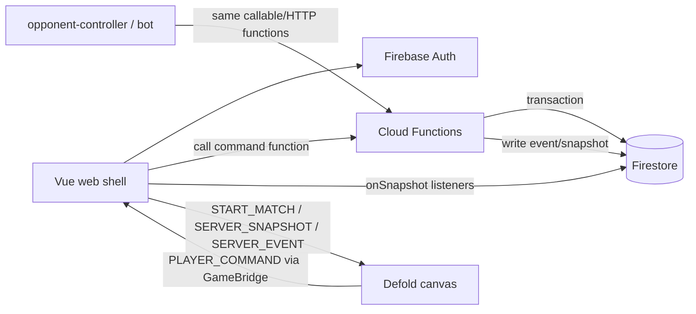

# Firebase Integration Plan

> Status: reference-only. The current preferred implementation path is root
> [`CONVEX_IMPLEMENTATION.md`](../CONVEX_IMPLEMENTATION.md).
> Keep this document as a Firebase comparison and fallback plan.

CylinderDicer는 FastAPI 또는 Backnd 대신 Firebase 중심 백엔드로 간다.

이 문서는 기존 [`SERVER.md`](SERVER.md)의 서버 권위 원칙과 [`BACKND_INTEGRATION.md`](BACKND_INTEGRATION.md)의 BaaS 검토를 Firebase 기준으로 재정리한 적용 계획이다. 결론은 단순하다. 제품 1차 배포가 웹 기반 Vue shell + Defold canvas 구조이므로, Firebase Web SDK를 Vue 쪽 service layer에 붙이고 Defold는 기존 `GameBridge`를 통해 command/snapshot만 주고받는다. Defold Firebase extension은 native Android/iOS/macOS 빌드와 analytics/remote config 확장용으로 보류한다.

## Decision

### Adopt

- Firebase Auth: guest/anonymous login, later Google/Apple provider linking.
- Firestore: player profile, inventory, season stats, match metadata, event log, snapshots.
- Cloud Functions for Firebase: match command validation, RNG, duel resolution, rewards, leaderboard updates.
- Firebase Hosting: Vue shell hosting candidate.
- Firebase Emulator Suite: local integration tests and QA.
- Firebase App Check: web client abuse reduction after MVP.
- Firebase Analytics / Remote Config: optional, later. Native Defold path can use Defold Firebase extension.

### Avoid

- Direct client authority for match result, dice, duel, HP, rewards, ranking.
- Defold GUI scripts calling Firebase directly.
- Firestore client writes that mutate authoritative match state without Cloud Functions validation.
- Treating `defold/extension-firebase` as a full Firebase backend SDK. It is core initialization plus platform bridge, with Firebase products split into separate Defold extensions.

## Why Firebase

Firebase fits CylinderDicer better than FastAPI for first product slice because current product shell is already web-first:

- Vue owns account, lobby, shop, ranking, inventory, and Defold embed.
- Defold runs inside an iframe/canvas and already communicates with Vue through `GameBridge`.
- Firebase Web SDK can live in Vue without custom native extension work.
- Cloud Functions can replace the FastAPI command API while keeping server-authoritative match rules.
- Firestore realtime listeners can feed snapshots/events to Vue, then Vue forwards display updates to Defold.
- Emulator Suite gives local backend testing without maintaining a separate Python server during early iteration.

Backnd remains a useful reference for account/ranking/payment feature shape, but Firebase gives better web-native integration and local emulator tooling for this repository.

## Source Notes

- Defold Firebase extension docs: <https://defold.com/extension-firebase/>
- Defold Firebase GitHub: <https://github.com/defold/extension-firebase>
- Latest checked release: `2.2.1`, published `2026-06-01`, with Defold `1.13.0` badge.
- The Defold extension documentation says the core extension initializes Firebase apps for iOS, macOS, and Android. Product-specific Defold extensions currently linked there include Firebase Analytics and Firebase Remote Config.
- The Defold setup requires adding a Defold library dependency, adding Android `google-services.xml` or Apple `GoogleService-Info.plist` under bundle resources, and setting `bundle_resources = /bundle`.

## Architecture



Primary runtime path:

```text
Defold GUI input
  -> msg.post("/game#client_controller", "player_command", payload)
  -> Defold GameBridge emit PLAYER_COMMAND
  -> Vue GameBridge listener
  -> Firebase service submitCommand()
  -> Cloud Function validates command in transaction
  -> Firestore match event + private/public snapshots
  -> Vue Firestore listener receives update
  -> Vue sends SERVER_SNAPSHOT / SERVER_EVENT to Defold
  -> Defold render cache updates
  -> GUI render
```

## Responsibility Split

### Cloud Functions

Cloud Functions own all authoritative game decisions:

- match creation and participant validation
- player seat/order
- turn/phase FSM
- dice roll RNG
- cylinder load/spin/trigger legality
- bid validation
- duel judge/resolution
- HP, elimination, winner
- command idempotency
- reconnect snapshot generation
- event log append
- profile/stat/ranking/reward updates

### Firestore

Firestore stores durable state and realtime views:

- user profile
- inventory/cosmetics
- match metadata
- match event log
- latest public snapshot
- per-player private snapshot
- season/ranking documents
- purchase/reward ledger

Firestore rules must deny direct authoritative mutation from clients. Clients may read allowed docs and may write only clearly non-authoritative user preferences. Match command writes go through Cloud Functions.

### Vue

Vue owns Firebase SDK integration:

- auth/session lifecycle
- lobby/match creation UI
- service layer wrappers
- Firestore listeners
- callable/HTTP Cloud Function calls
- Defold iframe bridge
- account/shop/inventory/ranking screens
- reconnect/resync UX

Vue should be the only Firebase Web SDK surface in the first implementation.

### Defold

Defold owns play presentation:

- input collection
- animation and sound
- GUI rendering
- local render cache
- command intent creation
- native-only Firebase extension integration later, if needed

Defold must not decide final match outcome. It should not store Firebase credentials. It should not write Firestore directly.

## Firebase Data Model

Suggested top-level collections:

```text
users/{uid}
  profile
  inventory
  private/preferences

matches/{matchId}
  meta
  snapshots/public
  players/{uid}
  events/{eventId}
  commands/{commandId}

seasons/{seasonId}
  rankings/{uid}

ledger/{ledgerId}
```

### `users/{uid}`

```json
{
  "displayName": "You",
  "createdAt": "serverTimestamp",
  "lastLoginAt": "serverTimestamp",
  "linkedProviders": ["anonymous"],
  "currentSeasonId": "season_2026_01"
}
```

### `users/{uid}/inventory/state`

```json
{
  "currencies": {
    "coins": 0,
    "gems": 0
  },
  "cosmetics": {
    "diceSkin": ["default"],
    "cupSkin": ["default"]
  },
  "equipped": {
    "diceSkin": "default",
    "cupSkin": "default"
  },
  "revision": 1
}
```

### `matches/{matchId}/meta`

```json
{
  "mode": "casual",
  "status": "ready",
  "createdAt": "serverTimestamp",
  "updatedAt": "serverTimestamp",
  "revision": 1,
  "players": ["uid_a", "uid_b"],
  "hostUid": "uid_a",
  "seedCommit": "sha256(server_seed)"
}
```

### `matches/{matchId}/events/{eventId}`

```json
{
  "revision": 43,
  "type": "bid.accepted",
  "actorUid": "uid_a",
  "payload": {
    "count": 8,
    "face": 3
  },
  "createdAt": "serverTimestamp"
}
```

### `matches/{matchId}/snapshots/public`

```json
{
  "revision": 43,
  "phase": "bidding",
  "hud": "bidding",
  "turn": {
    "activePlayerId": "uid_a"
  },
  "players": [],
  "availableActionsByPlayer": {
    "uid_a": ["bid.raise", "bid.challenge"]
  }
}
```

### `matches/{matchId}/players/{uid}/privateSnapshot`

Private player views include hidden dice/cylinder information that only that player may read.

```json
{
  "revision": 43,
  "dice": [1, 5, 3, 2, 6],
  "cylinderSlots": [
    { "index": 1, "loaded": true },
    { "index": 2, "loaded": false }
  ]
}
```

## Command Protocol

Defold and QA tools submit intents, never final results.

```json
{
  "commandId": "client_uuid",
  "matchId": "match_123",
  "actorUid": "uid_a",
  "seenRevision": 42,
  "type": "bid.raise",
  "payload": {
    "count": 8,
    "face": 3
  }
}
```

Cloud Function validation:

- authenticated user exists
- `actorUid == auth.uid` unless QA/admin actor is explicitly allowed
- match exists and is not complete
- command id has not been processed with different payload
- `seenRevision` is not too stale, or response includes resync snapshot
- actor has permission for this phase
- bid/cylinder/duel action is legal
- RNG is server-only

Response:

```json
{
  "ok": true,
  "commandId": "client_uuid",
  "revision": 43,
  "snapshot": {}
}
```

Failure:

```json
{
  "ok": false,
  "error": {
    "code": "not_actor_turn",
    "message": "It is not this actor's turn."
  },
  "snapshot": {}
}
```

## Cloud Functions

Initial callable/HTTP functions:

- `createGuestProfile`
- `createDevMatch`
- `createPrivateMatch`
- `joinMatch`
- `submitMatchCommand`
- `syncMatchSnapshot`
- `submitCosmeticEquip`
- `finalizeMatchRewards`
- `submitLeaderboardScore`

Internal helper modules:

```text
firebase/
  functions/
    src/
      index.ts
      auth.ts
      match/
        commands.ts
        reducer.ts
        rules-bidding.ts
        rules-cylinder.ts
        rules-dice.ts
        rules-duel.ts
        snapshots.ts
        transactions.ts
      profile/
      inventory/
      ranking/
      ledger/
      protocol/
```

`match/reducer.ts` should be ported from `play/game/model/*` but must not import Defold or Vue code.

## Vue Service Layer

Add services under `web/src/services/`:

```text
web/src/services/firebase/
  app.ts
  authService.ts
  matchService.ts
  profileService.ts
  inventoryService.ts
  rankingService.ts
  firestorePaths.ts
  errors.ts
```

`web/package.json` adds Firebase Web SDK:

```json
{
  "dependencies": {
    "firebase": "^latest"
  }
}
```

Vite env keys:

```text
VITE_FIREBASE_API_KEY=
VITE_FIREBASE_AUTH_DOMAIN=
VITE_FIREBASE_PROJECT_ID=
VITE_FIREBASE_APP_ID=
VITE_FIREBASE_MESSAGING_SENDER_ID=
VITE_FIREBASE_STORAGE_BUCKET=
```

These values are client config, not admin secrets. Admin SDK credentials and service account keys must never enter `web/`, `play/`, or committed docs.

## Defold Bridge Changes

Extend `shared/protocol/game-bridge.ts`:

```ts
export type GameBridgeMessageType =
  | 'DEFOLD_READY'
  | 'START_MATCH'
  | 'MATCH_READY'
  | 'PLAYER_COMMAND'
  | 'SERVER_SNAPSHOT'
  | 'SERVER_EVENT'
  | 'COMMAND_REJECTED'
  | 'SET_COSMETICS'
  | 'COSMETICS_APPLIED'
  | 'PING'
  | 'PONG'
  | 'UNKNOWN_MESSAGE'
```

New Defold side modules:

```text
play/game/net/firebase_adapter.lua
play/game/client_controller.script
```

Target flow:

```text
GUI script
  -> msg.post("/go#client_controller", "player_command", payload)
  -> client_controller.script emits PLAYER_COMMAND
  -> Vue matchService.submitCommand()
  -> SERVER_SNAPSHOT message returns
```

Migration rule:

- GUI scripts stop requiring `game.model.actions`.
- GUI scripts stop dispatching store actions directly.
- Existing local reducer/store remains as dev simulator until Firebase command loop is ready.
- Defold native editor mode can keep `start_dev_match()` for fast UI iteration.

## Defold Firebase Extension Use

Do not add `defold/extension-firebase` to `play/game.project` for the web MVP.

Use it later when native builds need Firebase Analytics or Remote Config without Vue:

1. Add dependency under `[project]`:

```ini
dependencies#N = https://github.com/defold/extension-firebase/archive/2.2.1.zip
```

2. Add bundle resources:

```ini
bundle_resources = /bundle
```

3. Android:

```text
play/bundle/android/res/values/google-services.xml
```

Generate from `google-services.json` using the extension helper script.

4. iOS:

```text
play/bundle/ios/GoogleService-Info.plist
```

5. macOS:

```text
play/bundle/osx/Contents/Resources/GoogleService-Info.plist
```

6. Lua initialization:

```lua
function init(self)
	if firebase then
		firebase.set_callback(function(self, message_id, message)
			if message_id == firebase.MSG_INITIALIZED then
				print("Firebase initialized")
			elseif message_id == firebase.MSG_ERROR then
				print("Firebase error:", message.error)
			end
		end)
		firebase.initialize()
	end
end
```

Native extension secrets/config files must be environment-specific and reviewed before commit.

## Firestore Security Rules

Rules principle:

- users can read/write limited profile/preferences for themselves
- users can read match public snapshots for matches they participate in
- users can read only their own private match snapshot
- clients cannot write `matches/*/events`, `snapshots`, authoritative match fields, ledgers, rankings, rewards
- Cloud Functions Admin SDK performs authoritative writes

Sketch:

```text
match /matches/{matchId}/events/{eventId} {
  allow read: if isParticipant(matchId);
  allow write: if false;
}
```

Detailed rules should be implemented with emulator tests before production.

## Local Development

Use Firebase Emulator Suite:

```text
firebase emulators:start --only auth,firestore,functions,hosting
```

Local flow:

1. Start emulators.
2. Start `web` Vite dev server.
3. Run Defold editor/build as now.
4. Vue connects to emulator config in dev mode.
5. `opponent-controller` and `opponent-bot` submit the same command protocol.

`vertual-server/` becomes legacy QA fallback. It should not be product architecture.

## Testing Plan

### Unit

- Port current 16 Lua model tests to TypeScript Cloud Functions tests.
- Test reducer determinism.
- Test bid ordering, challenge legality, cylinder load legality, duel resolution.

### Emulator integration

- Auth anonymous login.
- Create match.
- Submit legal/illegal commands.
- Assert event log and snapshots.
- Assert private snapshot visibility.
- Assert duplicate command idempotency.
- Assert Firestore rules deny direct event writes.

### Defold/Vue bridge

- `DEFOLD_READY` starts Firebase-backed match.
- Defold emits `PLAYER_COMMAND`.
- Vue submits command.
- Vue receives Firestore snapshot.
- Defold receives `SERVER_SNAPSHOT`.
- Command rejection maps to UX state.

## Migration Plan

### Phase 0: Decision record

- Add this document.
- Keep `SERVER.md` as historical FastAPI authority design.
- Mark Backnd doc as reference-only unless Firebase blocker appears.

### Phase 1: Firebase project and emulator

- Create Firebase project.
- Add web app config.
- Initialize `firebase/` workspace for Functions, Firestore rules, emulator config.
- Add local `.env.example` for Vite Firebase config.
- Do not commit secrets or service account keys.

### Phase 2: Protocol update

- Extend `shared/protocol/game-bridge.ts` with command/snapshot/event messages.
- Add TypeScript types for command, event, snapshot.
- Keep old `START_MATCH` payload shape until Defold adapter migration is complete.

### Phase 3: Vue Firebase shell

- Add Firebase Web SDK.
- Implement `authService`.
- Implement `matchService`.
- Implement Firestore listeners.
- Replace mock custom match startup with Firebase-backed dev match when emulator is enabled.

### Phase 4: Cloud Functions authority

- Port `play/game/model/*` rules to `firebase/functions/src/match`.
- Implement `createDevMatch` and `submitMatchCommand`.
- Write Firestore transaction around command validation + event append + snapshot write.
- Add emulator tests from existing Lua flow tests.

### Phase 5: Defold adapter

- Add `client_controller.script`.
- Convert GUI direct dispatch paths to messages.
- Add `firebase_adapter.lua` or bridge adapter that consumes server snapshots.
- Keep local simulator behind dev flag for editor-only work.

### Phase 6: QA tools

- Point `opponent-controller` to Firebase emulator functions.
- Point `opponent-bot` to same command API.
- Remove product assumptions from `vertual-server/`.

### Phase 7: Production hardening

- Firestore rules tests.
- App Check.
- Rate limits and command cooldowns.
- Logging/metrics.
- Error recovery and reconnect.
- Seed commit/reveal policy.
- Backup/export policy.
- Cost guardrails.

## Open Questions

- Firestore listener latency is likely enough for turn-based play, but should we keep a callable response snapshot for immediate UI feedback?
- Should ranked matches use Cloud Functions only, while casual/dev may use local simulator for faster iteration?
- Will native Android/iOS builds need direct Firebase Auth in Defold, or will they still embed/use the Vue shell?
- Do we need Cloud Run later for long-running matchmaking/bot workers, or are scheduled/functions enough?
- What is the first monetization surface: web-only cosmetics, mobile IAP, or no paid items until after MVP?

## Non-goals

- Do not migrate rendering or animation into Firebase.
- Do not make Firestore documents the only source of game logic.
- Do not add native Defold Firebase extension before a native build requirement.
- Do not expose admin credentials to Vue, Defold, or docs.
- Do not trust Defold/Vue match result payloads for rewards or ranking.
